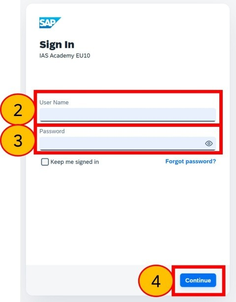
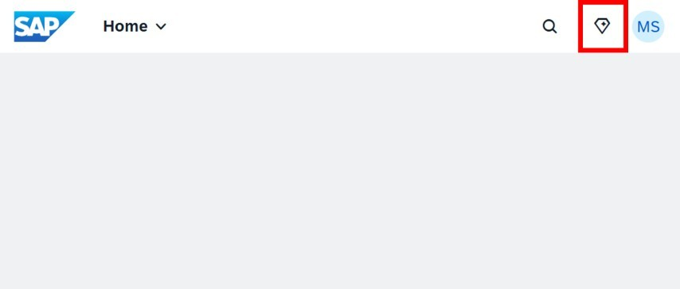
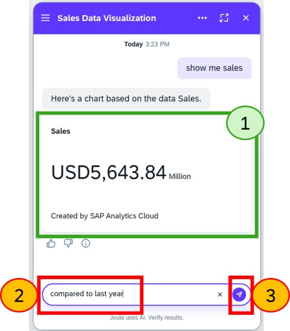
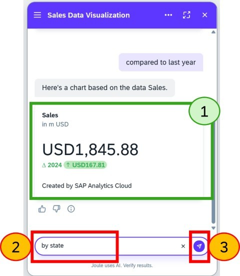
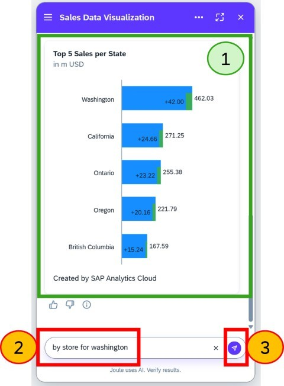
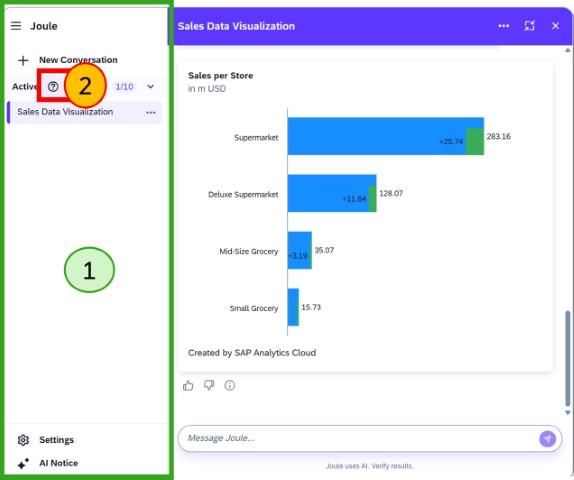

# Exercise 1: Use case 1: Workzone user

As an information consumer, you want to understand how sales in your organization compare to those in the various countries where you operate.
  

### Step 1:
1. Select 'Open link new window' by right-clicking on this link to [SAP Workzone](https://six-joule-sac-teched25.launchpad.cfapps.eu10.hana.ondemand.com/site?siteId=0ec917b6-0536-46a8-9bff-df00dd211f8a#Shell-home)
2. Log in with user ID displayed next to the TechEd laptop.
3. Log in with password displayed next to the TechEd laptop.
4. Click **Continue** or **Log On** 

> ⚠ Please note:     
>  * If you use an Ingonito window at any time, you must enabled 3rd party cookies.
>  * Consider the use of a 'guest' browser profile, which will automatically grant 3rd party cookies, if you choose not to use the default browser profile.

 
 
 
 

### Step 2:
1. Click **Joule** icon 

 
 
 
 

### Step 3:
1. Optionally, **Drag and drop** the Joule window so its comfortable to use
2. In the search box type `show me sales`
3. Press **enter** or click **send**

 
 
 
 

### Step 4:
1. **No action in this step**. Observe that you are instantly shown the total sales in $ and by millions (m).
A very simple question, but you’d like to see how your sales are performing compared to last year.
2. In the search box type `compared to last year`
3. Press **enter** or click **send**

 
 
 
 

### Step 5:
1. **No action in this step**. Observe that the Sales figure has changed to reflect the current year. Previously the figure was for all years. It also shows the variance to last year, as requested.
2. In the search box type `by state`, as you would now like to see how the same figures compare for business across all regional states.
3. Press **enter** or click **send**
  

 
 
 
 

### Step 6:
1. **No action in this step**. Observe the bar chart now showing the sales for each state and it has maintained the variance comparison to last year. You can see that the Washington state has the largest sales.
2. In the search box type `by store for washington`, as you would now like to see which stores are performing well in your best performing state.
3. Press **enter** or click **send**
  

 
 
 
 

### Step 7:
1. **No action in this step**. Observe the bar chart now showing the sales for each store type but filtered to just Washington. It has maintained the variance comparison to last year.
2. Maximise the Joule window
  

 
 
 
 

### Step 8:
1. **No action in this step**. Observe that our conversations with Joule can be seen and restarted in this window. .
2. **Click** the 'Learn More' icon to understand more about conversations. Once you've finished referring to the documentation, return back to this browser tab.
  

 
 
 
 

## Summary

You've now used Joule to access Analytics Insights.

Continue to - [Exercise 2 - Exercise 2 Description](../ex2/README.md)

