# Exercise 2 - Use case 2: Information Consumer

## Overview

### Persona

As an information user and occasional SAP Analytics Cloud user, though not an expert, you want to compare your organization's sales across different countries. While you're familiar with SAP Analytics Cloud, you prefer using a natural language interface to ask simple analytic questions. 
  
### Objective

+ To understand and experience the effectiveness of ‘just ask,’ so you can see how easy it is for business users to use.

+ To learn how model data structures can be leveraged to improve insights, visualisations, and how natural language processing can utilise these structures.

## Instructions

We estimate these instructions will take about 30 minutes to complete.

### Step  1: Access SAP Analytics Cloud
1. Select '**Open link new tab**' by right-clicking on this link to access [SAP Analytics Cloud](https://trial-bdc-sac-3.eu10.sapanalytics.cloud/sap/fpa/ui/app.html#/home)
2. You may be prompted to use the new theme, if so **select** 'Switch to Horizon'

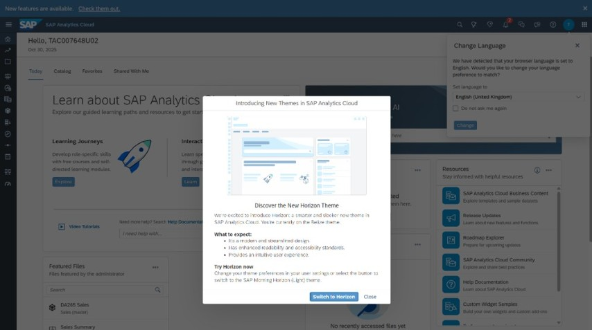
 
 
 
 

### Step  2: sales
2. In the 'Just Ask' card enter `show me sales`
3. Press **enter** or click **Ask**

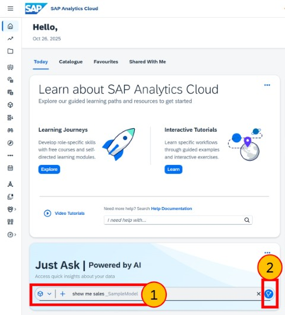
 
 
 
 

### Step  3: total sales (across all years)

1. **No action in this step**. Observe, as with Joule, the total sales in $ and by millions (m) is shown.
2. The 'Just Ask' overlay is shown. Close and re-open the overlay to appreciate how it works. Click **Just Ask** icon.
3. Click the **Just Ask** icon to reopen the overlay and see that it has remembered exactly where you were.

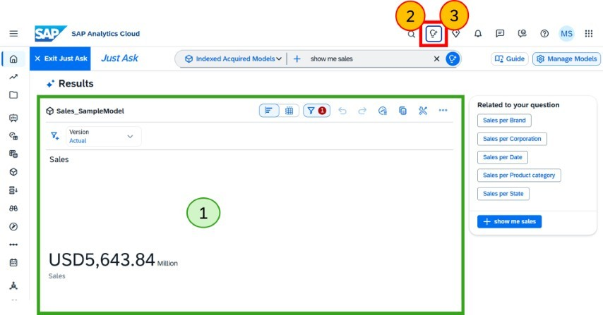

 
 
 
 

### Step  4: ... by state
  
1. Type `show me sales by state`
2. Press **enter** or click **Ask**

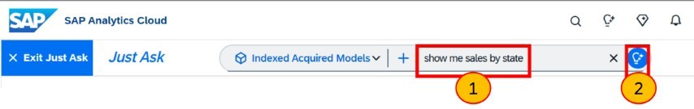

 
 
 
 

### Step  5: interact

+ The visualisation is interactive, just like it is within an SAP Analytics Cloud story.
+ You can instantly compare the performance of one state against another.
1.	Click on **Washington**, then
2.	Click on **Ontario** to show the difference in sales performance.
3.	Observe the pop-up showing the variance.

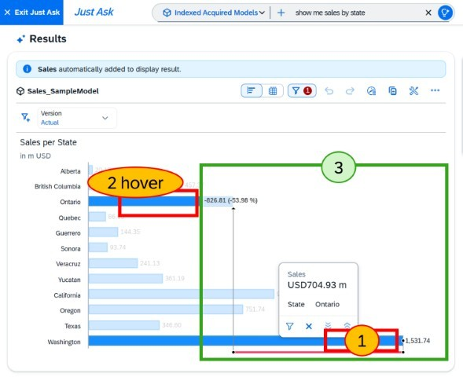

 
 
 
 

### Step  6: switch to table

A table provides an easier way to see the hierarchy of states across countries.  
  
1. Click on **Table**
2. Click on **Mexico** and **USA** to show the Sales at the country level.
  
It would be nice to visualise these values which we shall do very shortly…

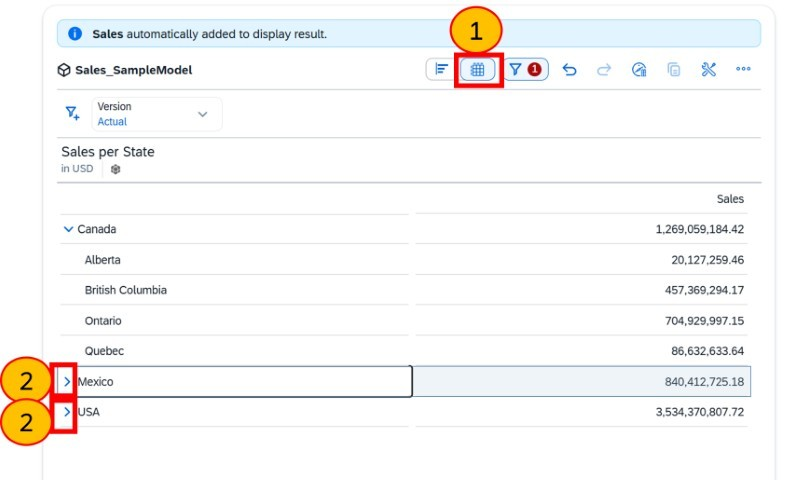

 
 
 
 

### Step  7: Now year-to-date

The results so far, are across all time. You’re keen to see year-to-date (YTD) sales.
  
1. Type `show me sales ytd by state`
2. Press **enter** or click **Ask**

> [!NOTE]
> The figures in the screenshots may vary as 'year-to-date' semantics change throughout the year. Just Ask knows the current time, and the screenshots were taken in October 2025. 

  

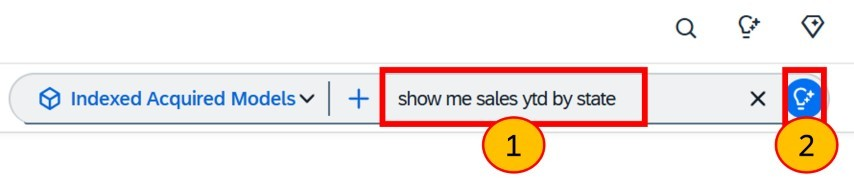

 
 
 
 

### Step  8: Date filter automatically added, edit chart
  
1. Click on ‘**Date**’ to show the date range.
2. Observe the date selection has automatically selected the current year. Just Ask is aware of the current time.
1. Click on ‘**Edit chart**’ as we would like to add the Store dimension to this chart and explore what's possible.

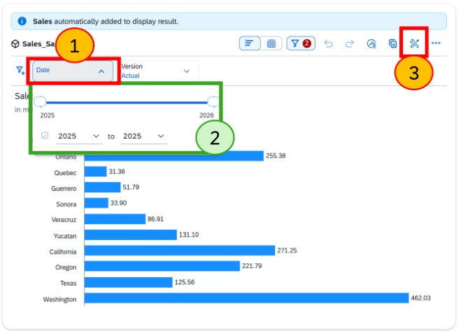

 
 
 
 

### Step  9: add dimension 'Store'
  
1. Click on ‘**Add Dimension**’ so we can add Store

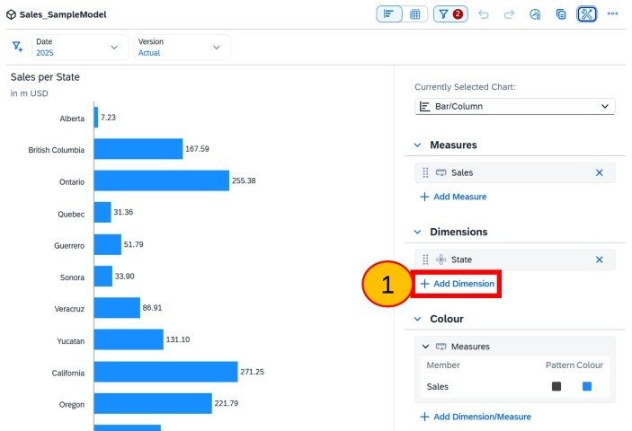

 
 
 
 

### Step  10:
  
1. Click on ‘**Store**’ to add Store to the chart

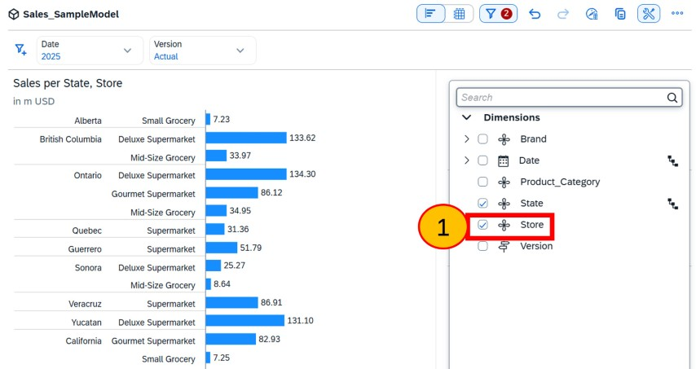

 
 
 
 

### Step  11: Year-to-date & top-level

Combining the ‘YTD’ and the ‘top-level’ shown just a moment ago with the table so we can visualise that table from earlier, but with YTD values
  
1. Type `show me sales ytd by state drill on top level`
2. Press **enter** or click **Ask**

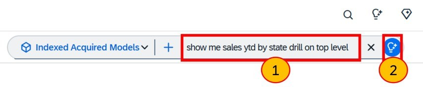

 
 
 
 

### Step  12: And the chart continues to be interactive:
  
1. Optionally, click on **Canada**
2. Optionally, click on **Drill Down on State** pop-up
3. Explore this dataset, click on **Analyze Data** which will open a new browser tab. 

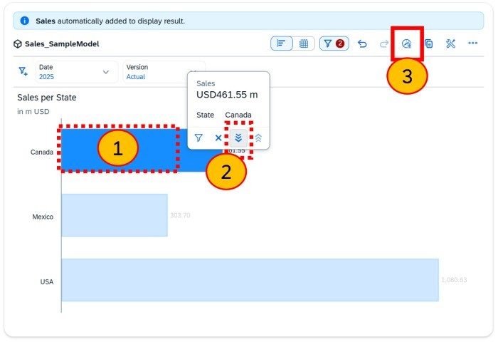

 
 
 
 

### Step  13: Explore Data Analyser
  
1. If *Builder* is **not** shown, click to **Expand**
2. If *Available Objects* are **not** shown, click **Available Objects**
3. Add **Store** as a *row*. It's easy to extend and tailor your visualisation.
4. No action. Observe that the entire context of the question has been passed with all filters pre-selected to ensure you can continue your exploration without the need to re-select. The filters panel can be accessed.
5. The filters are shown in this filters panel.
5. Close the browser tab.

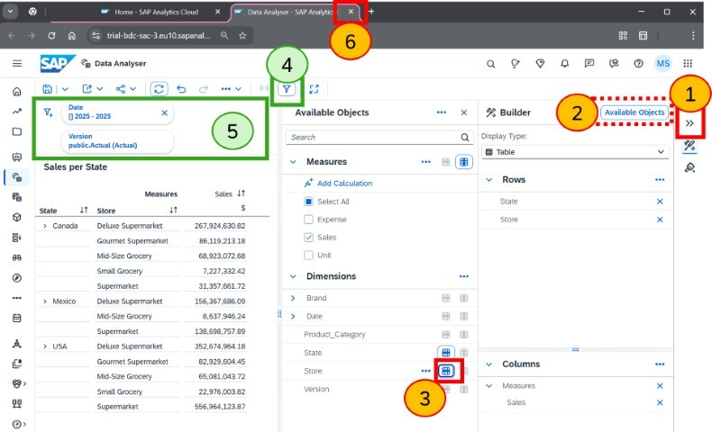

 
 
 
 

### Step  14: You’re keen to see how the USA is performing.
  
1. Type `show me sales ytd by state drill on country USA`
2. Press **enter** or click **Ask**

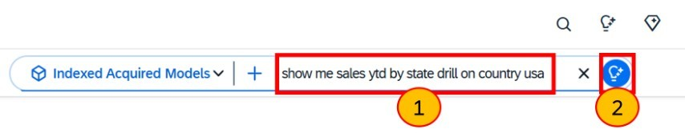

 
 
 
 

### Step  15: Drill level has been set automatically

**No action in this step**. Observe the drill level has been set
  
1. Click on **...**
2. Select **Drill**
3. Select **State** and see **Country** is the drill option set for you.

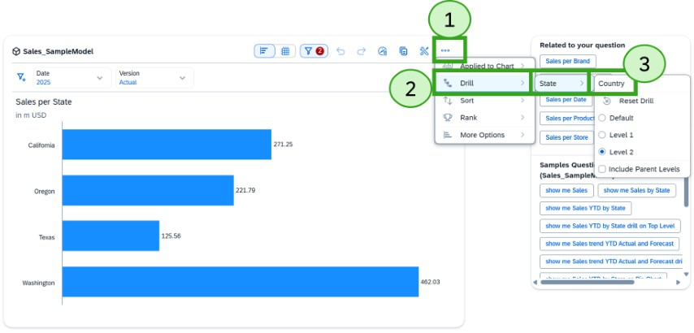

 
 
 
 

### Step  16: Now you’d like to see how sales are compared to forecast.
  
1. Type `show me trend sales actual and forecast`
2. Press **enter** or click **Ask**

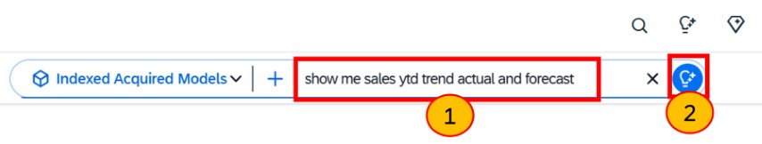

 
 
 
 

  
### Step  17: Version + chart type has been set automatically

**No action in this step**. Observe the Version has been set
  
1. Click on **Version**
2. Observe that both Actual and Forecast versions have been selected for you.
3. As you asked for *trend*, a time-series chart is shown, allowing you to easily change the time span as needed.

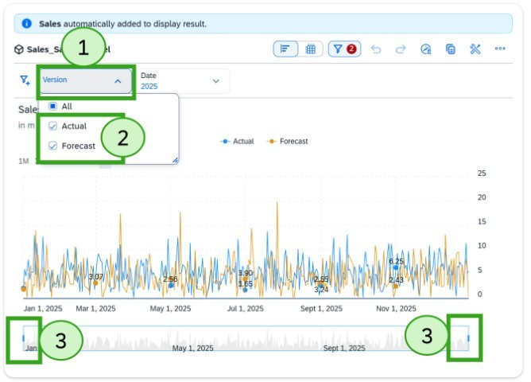

 
 
 
 

### Step  18: ... by quarter than by day

Whilst a time-series chart is handy, you’re a quarterly-driven sales organisation, and you’re only interested in the *quarterly* summary. 
  
1. Type `show me trend sales actual and forecast drill by quarter`
2. Press **enter** or click **Ask**

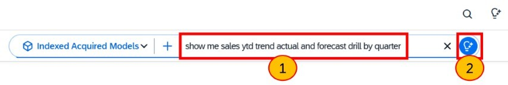

 
 
 
 

### Step  27: drill level set to Quarter

No action in this step.

  

Observe the Drill has been set
  
1. Click on **...**
2. Click **Drill – Date**
3. Observe *Quarter* has been selected for you as the drill level and the time-series chart x-axis now shows quarters, rather than days.

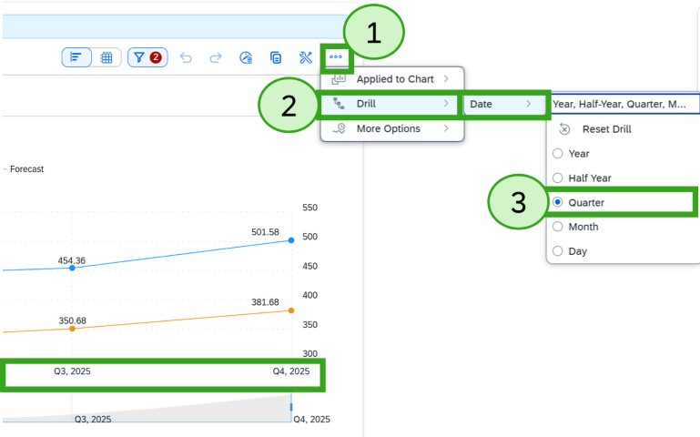

 
 
 
 

### Step  28: Performance by store

Now you’d like to turn your attention to the performance by store (type).
  

1. Type `show me sales ytd by store as a pie chart`
2. Press **enter** or click **Ask**

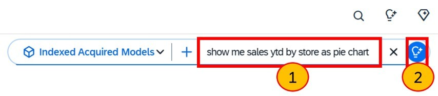

 
 
 
 

### Step  29:
No action in this step.  
  
Observe you can ask for the visualisation as you desire, in this case, a pie chart.
1. Clicking on a slice shows a pop-up window with more details.

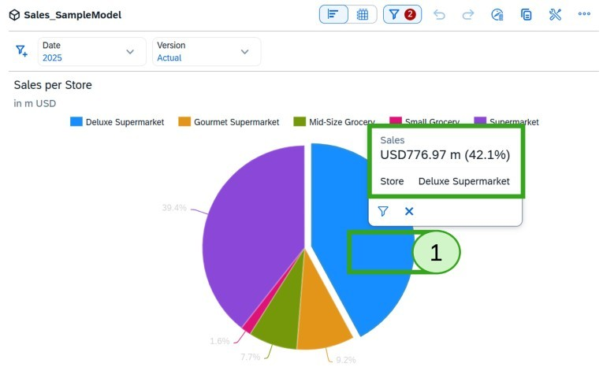

 
 
 
 

### Step  30: ... as a heatmap
  
1. Type `show me the sales by state and store as heatmap`
2. Press **enter** or click **Ask**

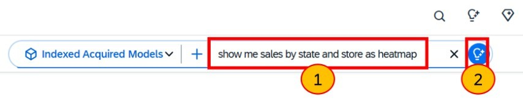

 
 
 
 

### Step  31: 

No action in this step.

  
Observe you may interact will all charts, including simple functions such as excluding.
  
1. Optionally click on a **value**
2. Optionally click on the **X** to exclude this State/Store 

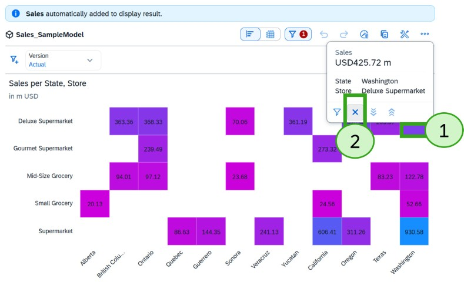

 
 
 
 

### Step  32: top-performing products

Now you need AI to help identify your top-performing products
  
1. Type `top 3 product by sales and state`
2. Press **enter** or click **Ask**
        
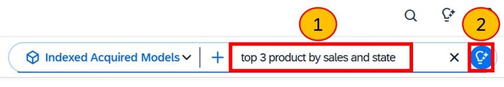

 
 
 
 

### Step  33: ranking has been automatically set

No action in this step.
 
Observe the ranking option has been selected for you
  
1. Click on **...**
2. Click on **Rank**
3. Click on **All Dimensions**
4. Observe **Top 3** has been selected for you. 

> If this visualisation differs from the one shown, please try again and inform your SAP workshop instructor. This will help us determine if a previous issue has been fully resolved.

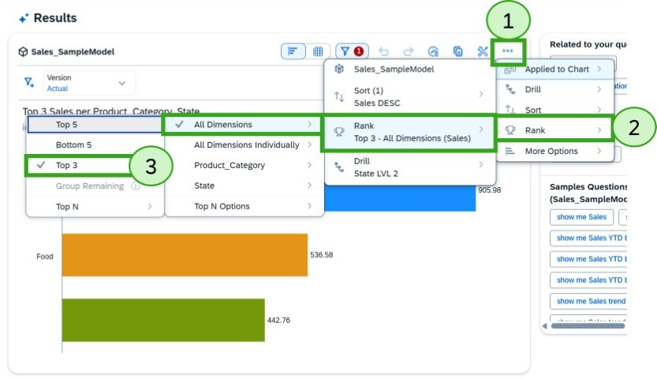

 
 
 
 

### Step  34: comparison with previous year

Your attention is now on the number of units sold and you want to compare 2025 units with the previous year:
  
1. Type `compare 2025 units with previous year`
2. Press **enter** or click **Ask**

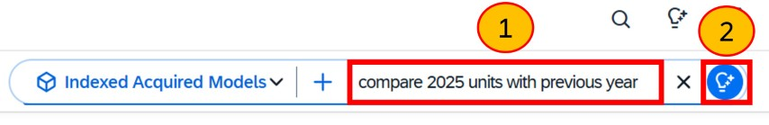

 
 
 
 

### Step  35: variance has been automatically set

No action in this step.
  

Observe the variance comparison has been selected for you with the current year also automatically selected
  
1. Click on **...**
2. Click on **Applied to Chart**
3. Observe the **Variance**

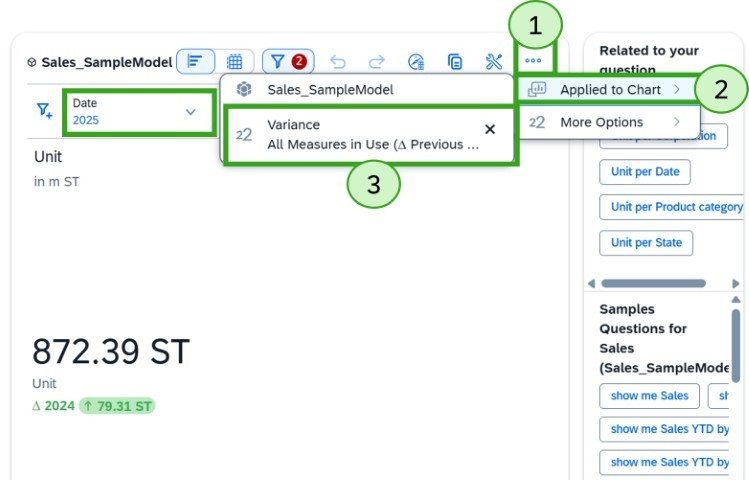

 
 
 
 

### Step  36: ... for each store

Now, you want to see how the 2025 units compare to previous years for each store.
  
1. Type `compare 2025 units with previous year by store`
2. Press **enter**, or click **Ask**

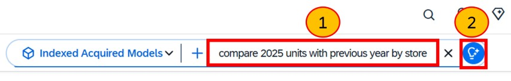

 
 
 
 

### Step  37: variance applied for each store

No action in this step. Observe the variance has been applied across the bar chart.

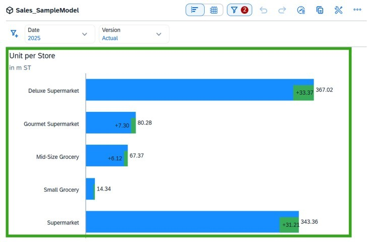

 
 
 
 

### Step 38: ... as %

You’re now curious about how figures are as a percentage difference so adding 'as %' or 'as pecentage' to the question.
  
1. Type `compare 2025 units with previous year by store as %`
2. Press **enter** or click **Ask**

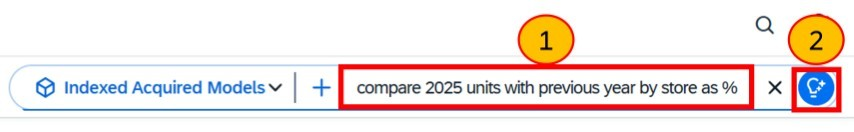

 
 
 
 

### Step 39: % variance added

 No action in this step. Observe the variance percentage shows that each store has sold exactly 10% more than last year.

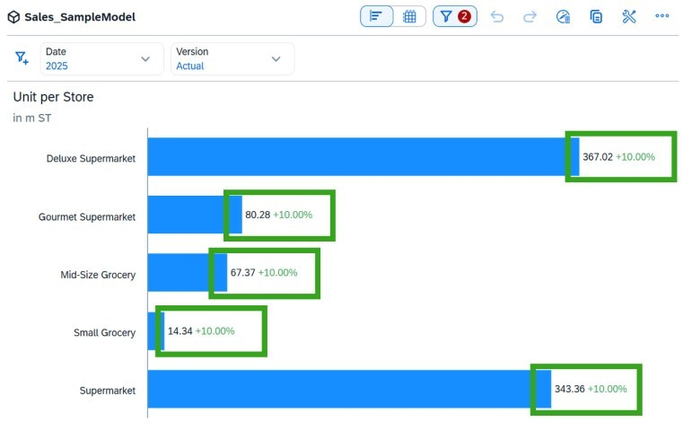

 
 
 
 

### Step 40: ... with forecast values for current month

You’re now interested in comparing units sold with the forecast, and for the current month
  
1. Type `compare actual units with forecast for this month`
2. Press **enter** or click **Ask**

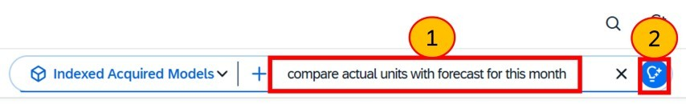

 
 
 
 

 ### Step 41: current month has been automatically set
 
 No action in this step. Observe the current month has been selected for you. (Screenshot taken in October 2025)
  
1. Click on **Date**
2. Expand **all**
3. Expand current year **2025**
4. Expand current **Half** *H2*
5. Expand current **Quarter** *Q4*
6. Observe the current month is selected for you. (screenshot taken in October 2025)

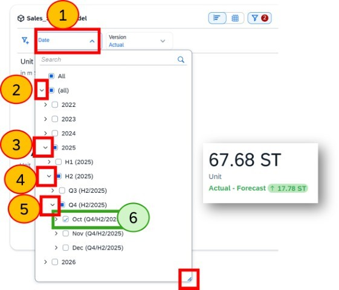

 
 
 
 

### Step 42: brands over 1 million

Your focus now turns to brands with over 1 millions units sold last year.
  
1. Type `show me units for brand and corporation by state >1m for last year 
`
2. Press **enter** or click **Ask**
        
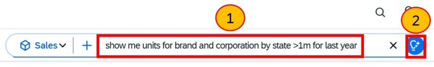

 
 
 
 

### Step 43: Measure filter has been automatically set

No action in this step. Observe the current month has been selected for you. (Screenshot taken in October 2025)
  
1. Click on **Date**
2. Expand **all**
3. Expand current year **2025**
4. Expand current **Half** *H2*
5. Expand current **Quarter** *Q4*
6. Observe the current month is selected for you. (screenshot taken in October 2025)

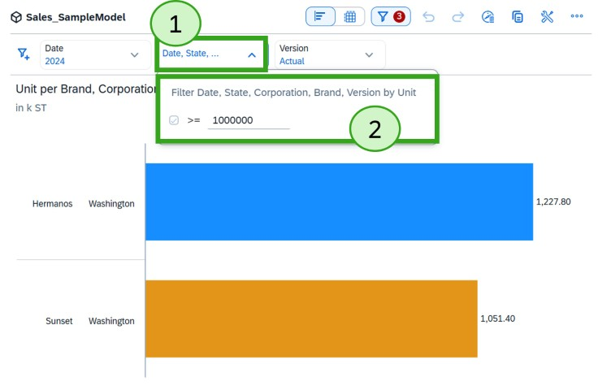

 
 
 
 

### Step 44: Next month's sales and expense

You want to now check the sales and expense for each store for next month
  
1. Type `what are the sales and expense by store next month`
2. Press **enter** or click **Ask**

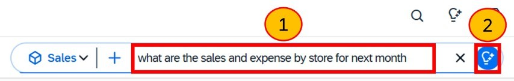
  

 
 
 
 

### Step 45: Next month has been automatically set 

No action in this step. Observe the next month has been selected for you. (Screenshot taken in October 2025)
  
1. Click on **Date**
2. Expand **all**
3. Expand year **2025** (for the next month)
4. Expand **Half** *H2* (for the next month)
5. Expand **Quarter** *Q4* (for the next month)
6. Observe the next month is selected for you. (screenshot taken in October 2025)

Observe the complexities of the filtering and variance comparison have all been done for you.

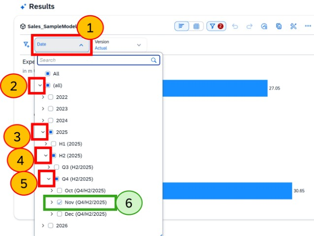
 
 
 
 

### Step 46: actual v forecast

You want to now check the sales for next month, but this time compare actuals with forecast
  
1. Type `what are the sales by store next month actual and forecast  `
2. Press **enter** or click **Ask**

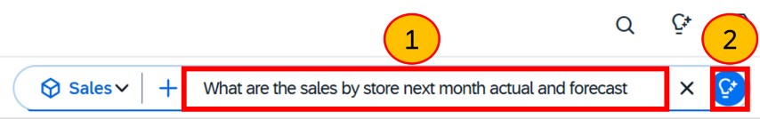
  

 
 
 
 

### Step 46: IBCS visuualizations when suitable

No action in this step. Observe the next month has been selected for you. (Screenshot taken in October 2025).

If your the visualisation is not as shown below, try adding `as bar chart` to your question.

SAP Analytics Cloud generates visualizations that are certified by the International Business Communication Standards (IBCS). This is the reason the forecast is presented in this specific format. Just Ask will consistently strive to create visualizations that adhere to IBCS guidelines. To learn more about IBCS, visit https://www.ibcs.com/software/sap-analytics-cloud/.

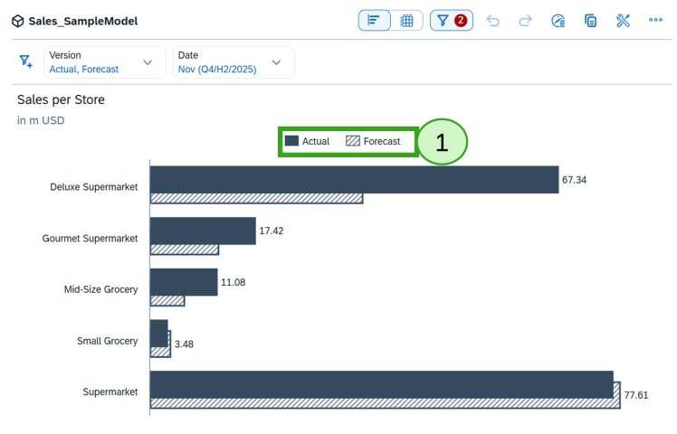
 
 
 
 
 
## Dynamically generated questions serve as prompts, helping you explore related inquiries.

### Step 47: Explore suggested questions

1. Observe (no action) the bottom right-hand corner has several pre-defined questions relating to the model in use.  You will use these soon, not now.
2. The top right-hand corner has several dynamically created questions you can ask. **Click** one of these.

  
  
Optionally repeat step 2 several times.

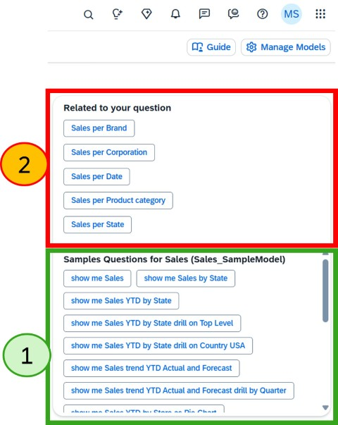

  

## Summary
You have learnt how simple it is to request analytical insights through natural language, with features such as:
+ Defining current, previous, and upcoming time periods, like ‘year to date’ or ‘next month’
+ Applying filters on dimensions or measures
+ Drilling into hierarchies 
+ Selecting different visualisations based on the question, such as time-series for trend analysis
+ Analysing variance and comparisons, including percentage differences across periods or versions
+ Ranking
+ Data IBCS visualisations generated automatically when appropriate

Additionally,
+ Using dynamically generated suggested questions

### Additional notes
Although not covered in this workshop, many other capabilities are supported, including:
+ **Language support** for German, French, Italian, and Spanish- note that the interface and model language must match.
+ **Sorting**
+ Support for **Datasphere** and **Business Data Cloud** models.
  + Currently at TechEd 2025, only a ‘live connection’ is available; however, SAP plans to support a ‘tunnel’ connection for indexed access, like SAP Analytics Cloud models. This feature is not yet released and may change- stay tuned!
	+ The planned ‘tunnel’ connection requires that the SAP Analytics Cloud and Datasphere Tenants be part of the Business Data Cloud Formation. 
  + Datasphere models with variables are supported; the value must be set when adding the model (You will learn how to add models in exercise 4)
+ **Currency** support and conversion: For instance, you can request figures to be displayed in Euros even if they are originally shown in US Dollars. The currency should be implemented using proper concurrency tables rather than a generic dimension. Additionally, there is a current restriction regarding currency support in Datasphere.

There are several restrictions worth noting. 
[Just ask restrictions ](https://help.sap.com/docs/SAP_ANALYTICS_CLOUD/00f68c2e08b941f081002fd3691d86a7/6eb78656cbca4b269d935573e651df54.html?locale=en-US)

### Next exercise

Continue to - [Exercise 3 - Use case 3: Explore the data model and find additional insights](../ex3/README.md)