# Exercise 3 - Use case 2: Explore the data model and find additional insights
  
This exercise will explore the data within a model without relying on IT to create any artefacts beforehand. Typically, IT will appropriately limit the scope of user stories and other artefacts, as the array of possibilities can be too vast for the time and effort required to cover all possibilities.
  
We will consume predefined questions before we use Just Ask to explore the data model.
  

## Consume (predefined) questions related to the model
As information consumers, we appreciate predefined questions that show what’s possible without the need to learn or remember how to phrase questions.
  
These predefined questions enable a low entry point for Information Consumers to adopt Just Ask.

  
  
 
 
 
 

### Step 1: Explore predefined questions

Return to the main Just Ask homepage and explore predefined questions.
1. Click on the **Just Ask** logo.
2. Expand the **Sample Questions**
3. Expand the model **Sales**
4. Select any of the questions shown.

  

Optionally repeat the above multiple times.

  

  

 
 
 
 
  

### Step 2: Exit Just Ask
  
1. Click on **Exit Just Ask**

  

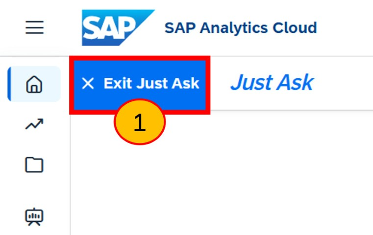
  
 
 
 
 

## Explore the model, and add new charts to an existing story

As *Information Consumers*, we have little expertise in creating SAP Analytics Cloud stories. So, we shall use Just Ask to explore the data model and add a new visualisation created by AI, into an existing Story.

We will make a copy of an existing story, so we have edit rights on it, and then add a new AI-powered visualisation to it. Not all users will do this, and many could create a new story instead of enhancing an existing one.

 
 

When we copy the story, we shall also copy the underlying data model as we shall enhance this copied model later.

 
 

### Step 3: Copy story + model to 'my files'

Take a copy of the story, and the model. We shall store these copies into our own private 'my files' folder.
  
1. Click **Menu**
2. Click **Files**
3. Click **Features Files** (the story and the models have been 'featured' for us to easily identify).
4. Select the '**all**' check box
5. Click **Copy**

 
 
 
 

### Step 4: Select target 'My Files'
  
1. Click **My Files** folder 
2. Check that your target folder is empty, except for 'Public' and 'Samples'
3. Click **Copy** 
 
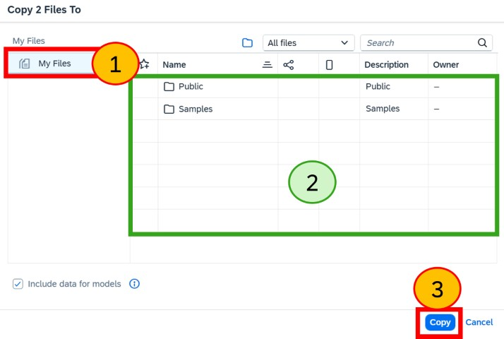

 
 
 
 

### Step 5: ...wait...

**No action in this step**. Kindly wait a moment during the copying process to complete.

 
 
 
 

### Step 6: Validate copy

1. Click **My Files** folder 
2. Check that your 'My Files' folder now contains 2 new files, one story and one model.
3. Click **Menu** to collapse the menu as shown.

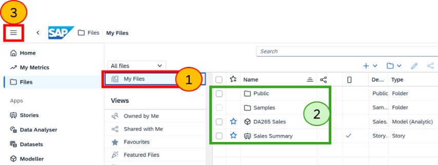

 
 
 
 

### Step 7: Open Story in edit mode

We can now open the Story in edit mode as you are the owner of this copied story.
1. For the 'Sales Summary' story, click **...**
2. and **Open in Story Edit Mode** from the pop-up menu

  

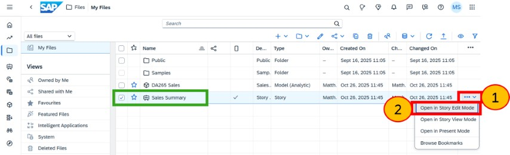

 
 
 
 

### Step 8: Navigate to page 'Global Essence Group'

1. Check the menu bar is collapsed as this provides more space
2. Click on the page 'Global Essence Group' as we shall add new visualisations to this page with the help of 'just ask'.
3. Click **Just Ask**

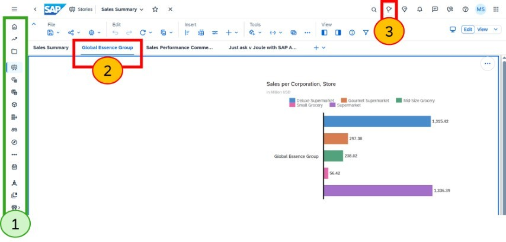

 
 
 
 

### Step 9: Explore data model

1. Return to the 'just ask' home page by clicking on **Just Ask**
2. We need to tell Just Ask which model we’re interested in exploring. Click on **model** selection.
3. At the moment we only have access to a single model, so only one will be shown. 

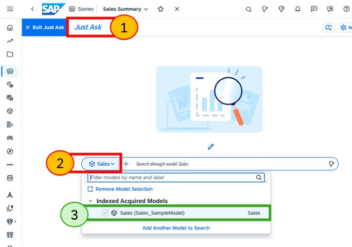

 
 
 
 

### Step 10: search through the model

1. Just a single click on the search box **'Search through model Sales'** will show a pop-down menu.
2. Observe the elements shown with the various icons for measures, dates, dimensions and versions, etc. It will also contain dimension member values, like the names of stores for the 'Store' dimension.

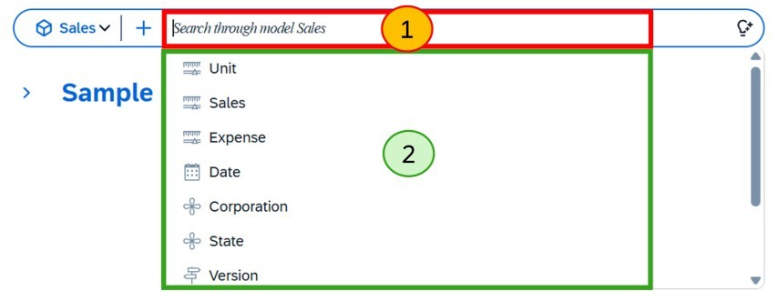
 
 
 
 

### Step 11: Explore hierarchy structure - select Corporation

1. Click on **+** and another pop-down menu is shown. This exposes more about the data structures including hierarchies.
2. Click (select) the **Corporation**

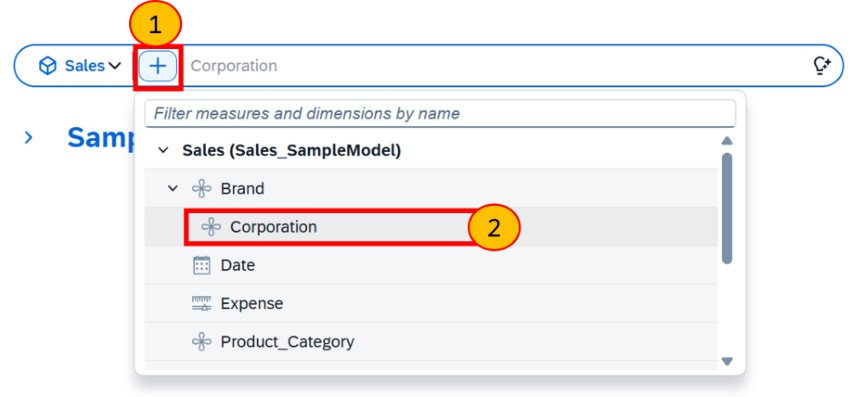
 
 
 
 

### Step 12: dimension values pop-down - select Global Essence Group
  
1. Place the cursor in the search box by clicking the **search box**.
2. No action, just observe the pop-down box appearing with the dimension values for 'Corporation'. Without even running a query you can start to explore the data in the model.
3. Click on the value **Global Essence Group** (a value of Corporation)

     
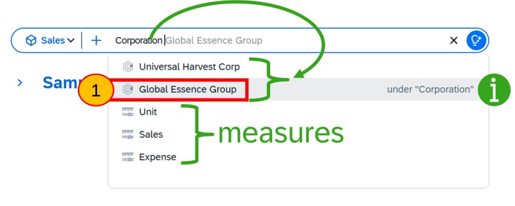

 
 
 
 

### Step 13: Add dimension Product_Category

With *Corporation Global Essence Group* selected
  
1. Click the **+** icon
2. Select the dimension **Product_Category**

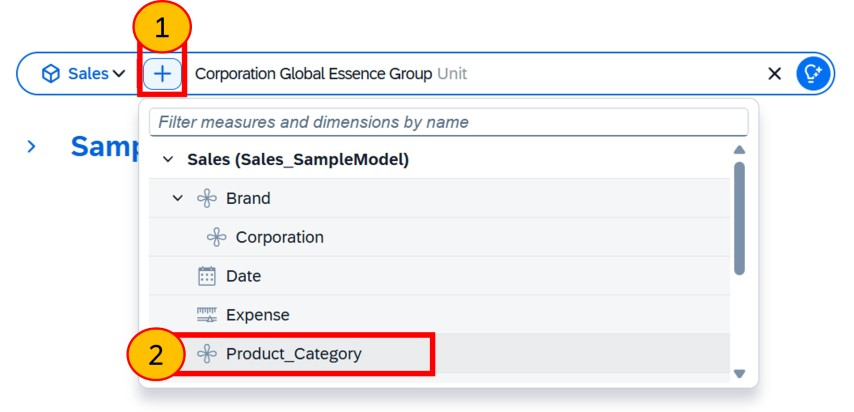

 
 
 
 

### Step 14: more dimension values exposed
The 'drop-down box' now shows the values 'under Product_Category'. These include 'Food, Drink, Other etc'. You will see these categories in the next visualisation step. 
  

Just Ask exposes values these dimensions have within the data, thus allowing you to explore
1. Press **enter**, or click **search** (without having selected any of these dimensions values)

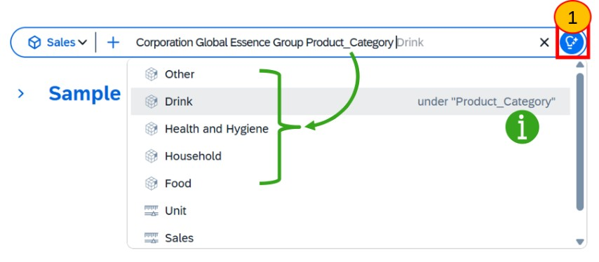

 
 
 
 

### Step 15: Measure added by default
  
1.	You did not need to specify a measure, so a default measure has been added for you. **Observe** the message saying 'Sales automatically added to the display result'. 
2.	As you are happy with this visualisation, you want to add it to the story. Click **Copy**. You will soon '*paste*' it into your copied story.
3.	Click **Exit Just Ask**

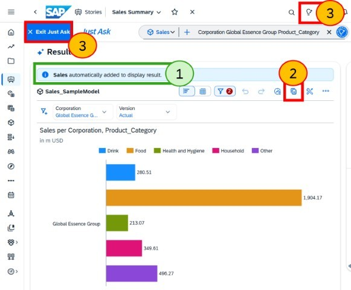

 
 
 
 

### Step 16: Paste into Story
  
1. Select the *Global Essence Group Page**.
2. Select the **copy/paste** icon.
3. Select **Paste**

  
If nothing is pasted, open Just Ask to access the visualisation and click **copy** again before exiting Just Ask to repeat this step.

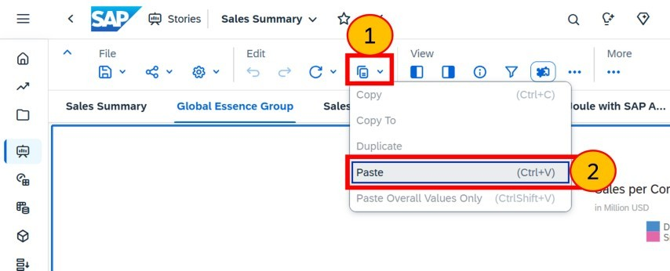

 
 
 
 

### Step 19: Re-size chart and save
  
1. **Re-size** the chart to make it larger.
2. Press **Save**, under **File**.

 
 
 
 

## Summary

You have now used Just Ask to explore the data model and added a new visualisation into a story you took a copy of.

If they have the rights, users may decide to create new Stories rather than edit copies of existing ones.

Continue to - [Exercise 3 - Excercise 3 ](../ex3/README.md)
