# Exercise 4 - Enhance the user experience

## Overview

### Persona

You are a Just Ask administrator with basic SAP Analytics Cloud modelling skills. 
  
### Objective

To improve the existing sample model and boost user experience, you will identify several 'areas for improvement' and address these issues by:
1. Upgrading the data model to enable consumers to obtain insights directly through the ‘just ask’ feature, including better handling of hierarchical data structures.
2. Implementing synonyms and rules to measure and dimension member values.

Additionally, you will use Joule to find documentation and steps required to index a model in Just Ask.

## Instructions

We estimate these instructions will take about 40 minutes to complete.

## States as Countries

### Step 1: Open Just Ask Home page

1. Click on the **Just Ask** icon (assuming the Just Ask overlay is not already displayed)
2. Click on the **Just Ask** logo to show the home page

  

 
 
 
 

### Step 2: No Country dimension shown
  
1. Click on the **+** icon.
2. Scroll down and notice there is no country shown, even though we know from earlier that countries are in the data model. Click **State**.

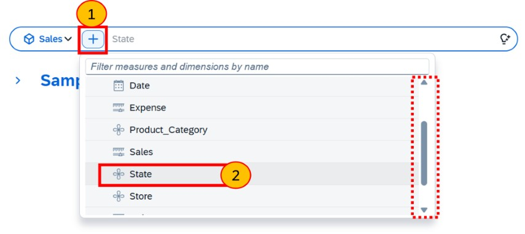
  

 
 
 
 

### Step 3: USA and Canada are states!
Observe that, for example, *USA* and *Canada* are listed as a state, when they are a country. Technically, it’s part of the 'state' dimension.

1. Click on the search box and enter the single character `c`
2. Observe that the list of values is filtered to those starting with 'c' to show 'Canada'. Canada is not a state!
3. Clear this question, by clicking **x** on the search box.

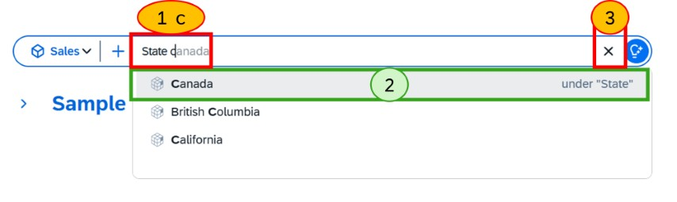
  

 
 
 
 

## Profit

### Step 4: try 'Country Profit'
  
1. Type `Country profit`, as this is a reasonable question.
2. Press **enter**, or click **search**

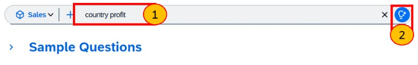
 

 
 
 
 

### Step 5: 'Country Profit' gives 'State Sales'

1. No action, just observe that *State* has been used instead of *Country*. But at least ‘Country’ was identified!
2. Sales were added, but you asked for Profit, which is the difference between Sales and Expenses, i.e. it’s a calculation. (`=Sales – Expense`)
  
Your users may also refer to units by their unit of measure 'PC' or 'PCs'. It means you can’t ask for '*country PCs*' when you mean '*country units*', for example. 

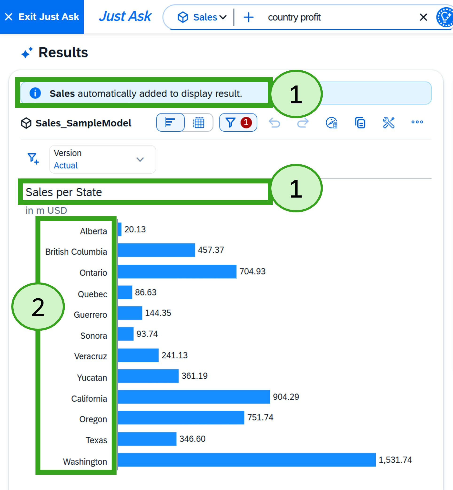
  

 
 
 
 

### Step 6: 'Grocery' should be all Grocery stores, not just one
  
Your business refers to '*Grocery*' as '*Mid-Size Grocery*' and '*Small Grocery*'.
However, when you ask for *Grocery Sales* both these values are not selected, instead, you must manually select the missing one.

Try it:
  
1.	Type `Grocery Sales`
2.	Press **enter**, or click **search**
3.	Open the **Store** filter
4.	Select the missing **Grocery** value, so that both 'Mid-Size' and 'Small' are selected.

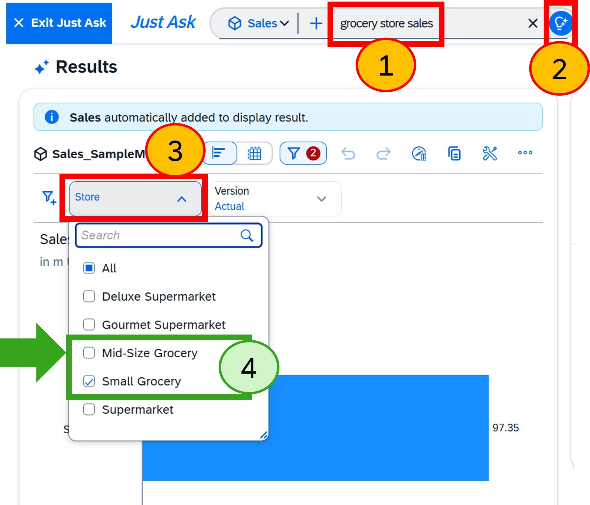
  

 
 
 
 

  
## Improving the user experience

As a Just Ask administrator, we will implement several improvements to address the issues mentioned earlier. It is crucial to work closely with your users to understand the questions they might want to ask, as this will help maximize adoption. Based on this understanding, you can make simple adjustments that encourage more users to engage with the system.

We have already made a copy of the existing model and will enhance this copy, leaving the original unchanged so other users can continue working with it.

 
 

### Step 11: Open the copied model from our 'My Files'
  
1. Expand the **navigation bar**
2. Select **'Modeller'**

> ***The next step must to be carried out carefully***
> + do **NOT** select the original in **'My Files/Public/DA265'** since we don't want to alter the original as  that could cause issues for other users of this workshop.
> + The order of files shown may differ from the screenshot.

3. Select the model **'DA265 Sales'** that is stored in **'My Files'** to open the model.
> Screenshot taken between steps 2 and 3
  

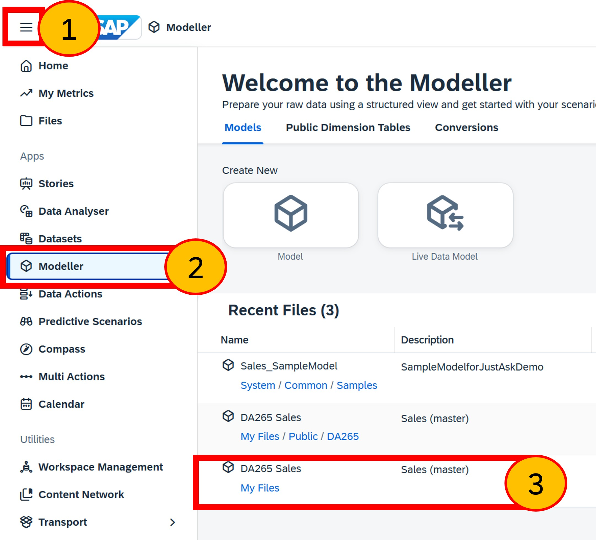
  

 
 
 
 

## Enhance the 'State' dimension so Just Ask knows about the Country

  
We will improve the ‘State’ dimension in our duplicated model, allowing Just Ask to display ‘Country’ as a selectable option under the ‘+’ icon. This change will help users understand that ‘Country’ is the parent of ‘State’ and will enable queries such as ‘Country sales.’

We will add a new property for each State, indicating the Country it belongs to. Since each State is already part of a Country hierarchy, we can easily copy the existing values into this new property.

 
 

### Step 12:  Open State dimension
1. Collapse the **navigation bar** to make a little more space on the screen
2. Select **Edit Dimension Table** for the State Dimension

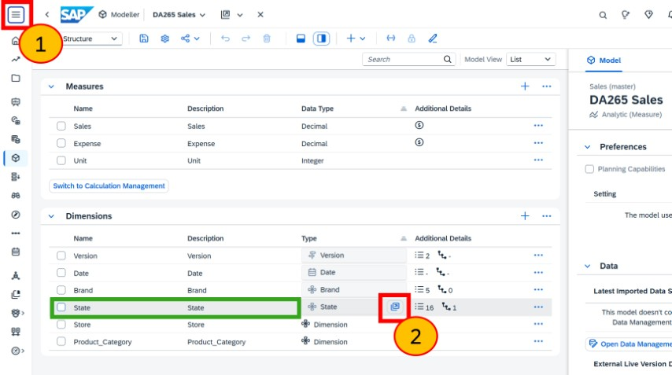
  

 
 
 
 

### Step 15: Create new property for State dimension
1. Change the display to a grid by selecting the '**grid**' (as shown in the screenshot)
2. No action. Observe that Country is a parent hierarchy of State.
3. **Scroll down** the properties of this dimension...
4. ... and select ***Create Property***. 

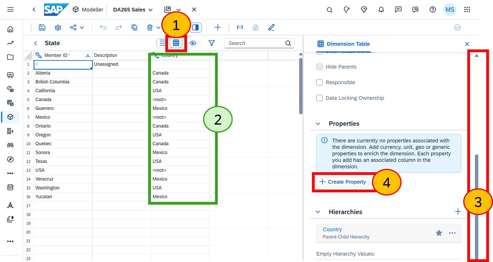
  

 
 
 
 

### Step 16: New property _Country
  
1. For the ID, enter `Country_` 
2. For the description enter `Country`
3. Press **Create**

We must use a different ID from the existing so adding an underscore _ makes the property different enough.

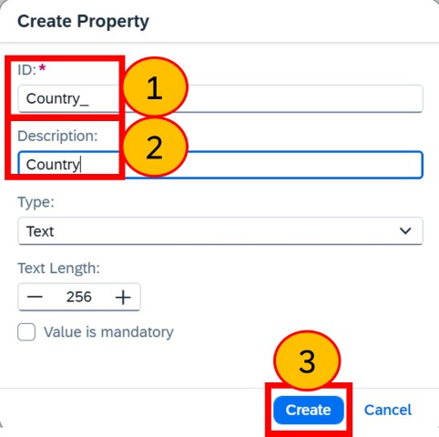
  

 
 
 
 

### Step 17: Copy 'Country' hierarchy values
  
1. Select all the values as shown (from row 2)
2. Press **CTRL-C** (to copy the values)

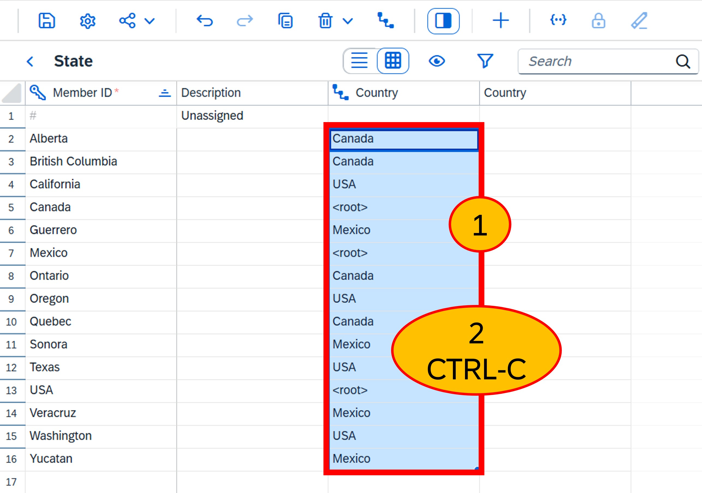
  

 
 
 
 

## Step 18: Paste into new Country_ property
  
1. Select **row 2** in the adjacent column for your new custom property
2. Press **CTRL+V** (to paste the values)
2. Press **Back**

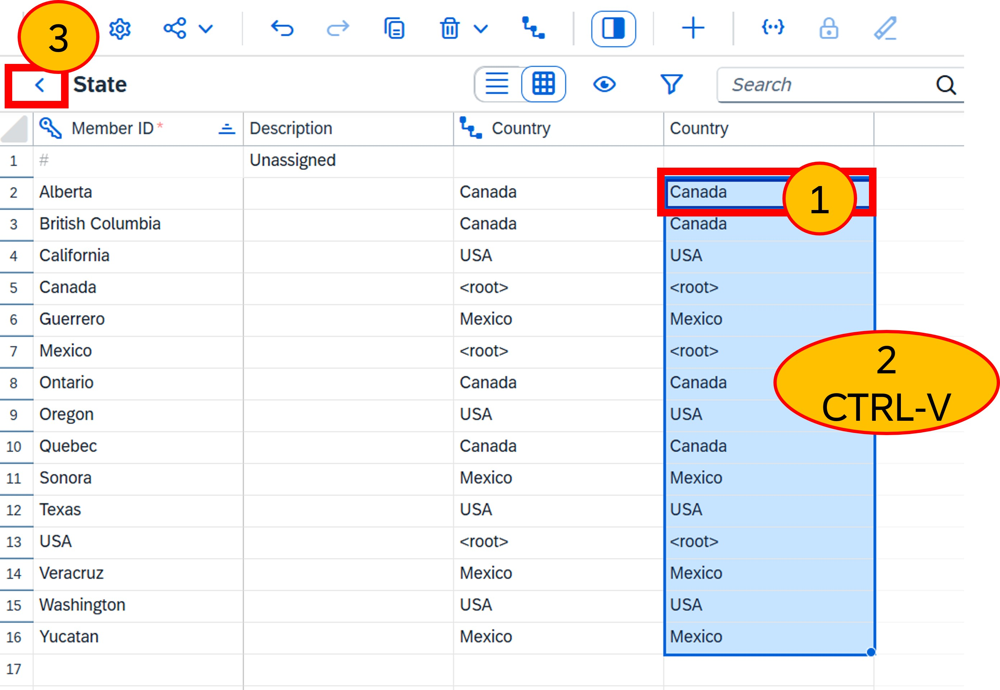
  

 
 
 
 

## Create a new measure calculation for Profit

Just Ask can't create new calculations on the fly, but it can use existing ones in the model. Profit has been identified as something an information consumer would like to use in natural language questions. So, we shall define profit as a measure of '*Sales – Expense*' for Just Ask to use.  

 
 

### Step 19: Switch to Calculation Management
  
1. Select **Calculations** or press **Switch to Calculation Management**

  

 
 
 
 

### Step 20: Add calculated Measure
1. Click **Add Calculated Measure**
2. Enter the Name `Profit`
3. Enter the Description `Profit`
4. In the formula box enter the three characters `[sa` 
5. A pop-up box will appear and select **\[Sales\]**

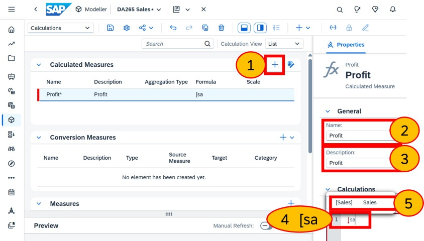
  

 
 
 
 

### Step 21: continue the formula
  
1. Once, \[Sales\] has been selected as shown, type the 3 characters `-[e`
2. A pop-up box will appear and select **\[Expense\]**

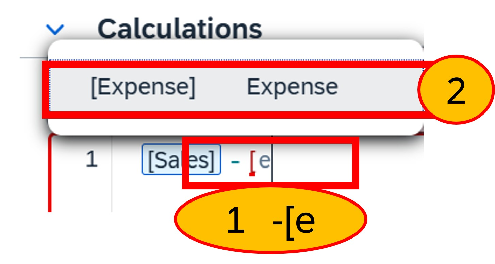
  

 
 
 
 

### Step 23: Validate
  **No action**
  
Validate the formula is valid and no errors are shown. If errors are shown, delete and try the previous steps again.

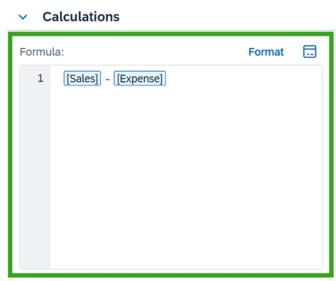
  

 
 
 
 

### Step 24: Change Unit Type
  
1. **Scroll down** within this new calculation
2. Change the Unit Type to **Currency**

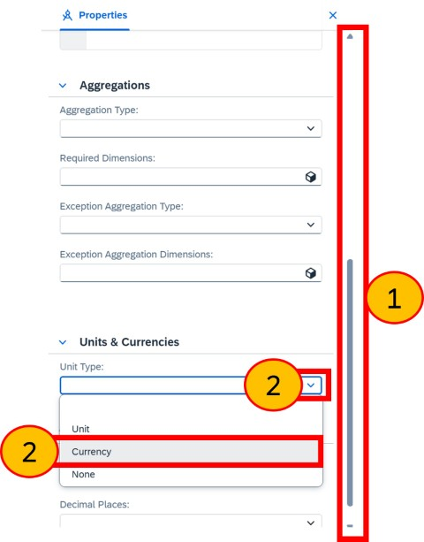
  

 
 
 
 

### Step 25: Save and access Joule to find next steps

Now we have

+ Added a new property to ‘State’ for ‘Country’. This will allow the ‘+’ button to show Country as a hierarchy of State’. It will also allow for questions like ‘Country Sales’.
+ Added a new measure calculation ‘Profit’.

Doing these two tasks will help improve the user experience. But we also need to add synonyms to our model.

But how we do that? How can we get add a model to Just Ask and add synonyms to it?

1. Click **Save**, so save the model.
2. Open **Joule**

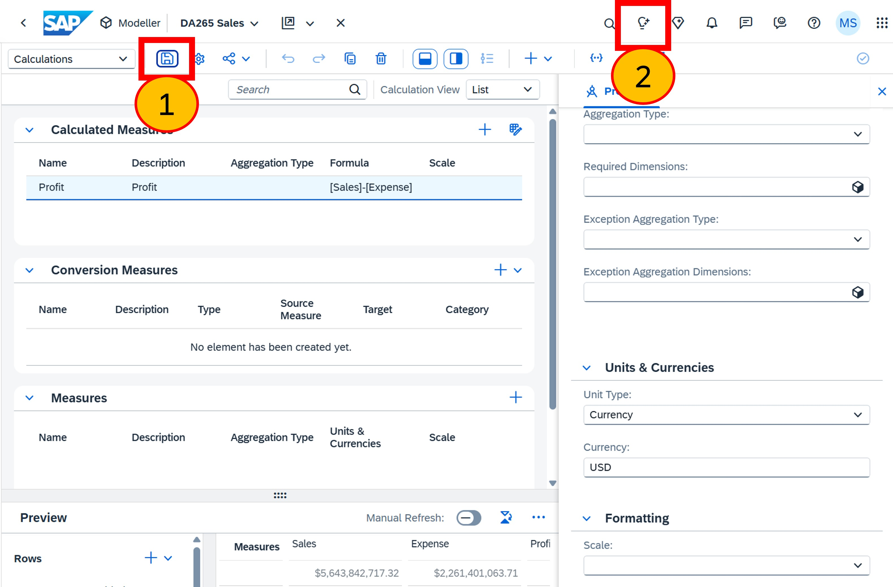
  

 
 
 
   

### Step 26: New Conversation
  
1. Open the menu
2. Select **'New Conversation'**

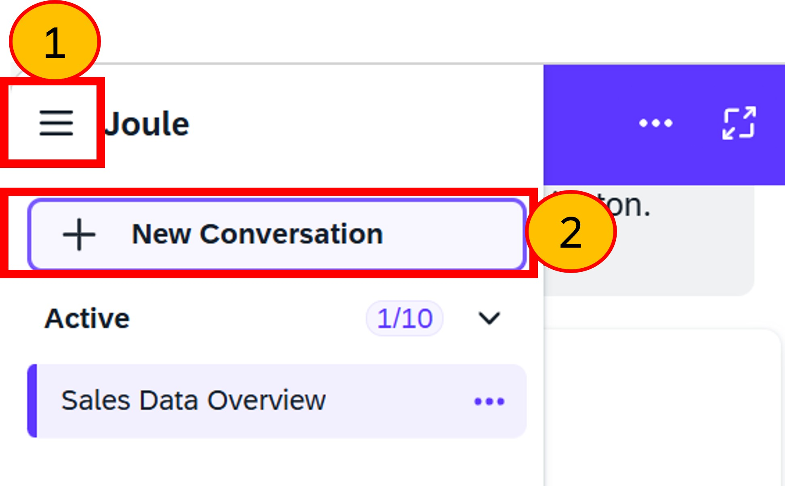
  

 
 
 
 

### Step 27: Ask Joule
  
1. Enter `how do I add a model to just ask and add synonyms to it` and press **send**

  

 
 
 
 

### Step 28: Joule responds with sources
  
1. Read the response for a summary, and then click the **Sources**

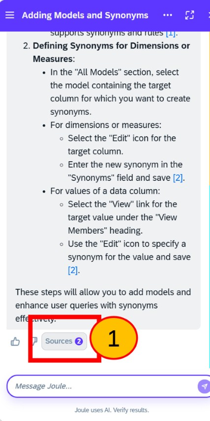
  

 
 
 
 

### Step 29: Source documentation
  
1. Click the Source **\[2] Manage Just Ask**
2. Another browser tab will have opened. This workshop will guide you through each step, but feel free to read the content. Once you have finished with that documentation page, please return to the previous browser tab.
3. Click **X** to close the ***Sources***

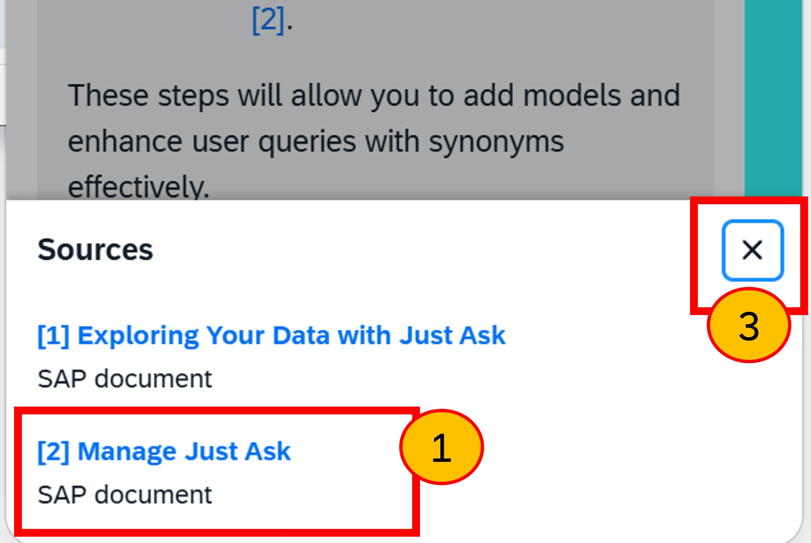
  

 
 
 
 

### Step 30: Close Joule, Open Just Ask, Open Manage Models
  
1. Click the **Joule** icon to close the Joule window.
2. Click the **Just Ask** icon to open the Just Ask overlay.
3. Click **Manage Models** to access the management page of Just Ask
> Screenshot was taken between steps 2 and 3

> As a user with Just Ask 'Administration' rights you have access to the 'Manage Models' interface.

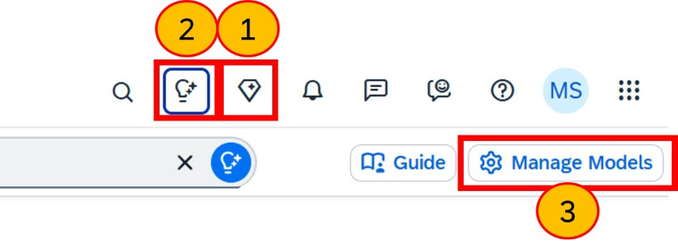
  

 
 
 
 

## Just Ask Model Administration

Some administration tasks are needed to improve the ease of use for Just Ask consumers. These tasks include:
  
- Indexing the model.
- Adding *synonyms* to measure names and dimension member values. 
- Setting a default *measure*.
- Creating a few *rules*.
- Other minor administration tasks.

### Step 31: Indexing the model
We need to index the model so that Just Ask can learn about its metadata and so that users can consume it without necessarily knowing it exists.

On the *All Models* page, your copied model will not be shown because it’s not yet indexed.
1. Click **Add Model** so Just Ask can index your copied model.

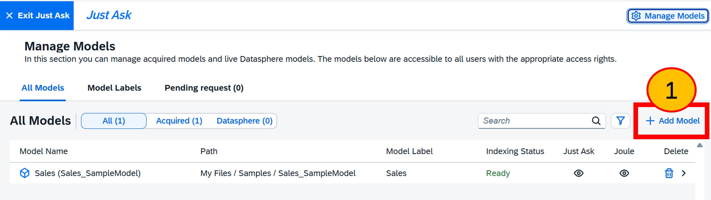
  

 
 
 
 

### Step 32: Add 'DA265 Sales' (in My Files)
1. Select your copied model **DA265 Sales** that should be in ***My Files***

> Indexing will start immediately.

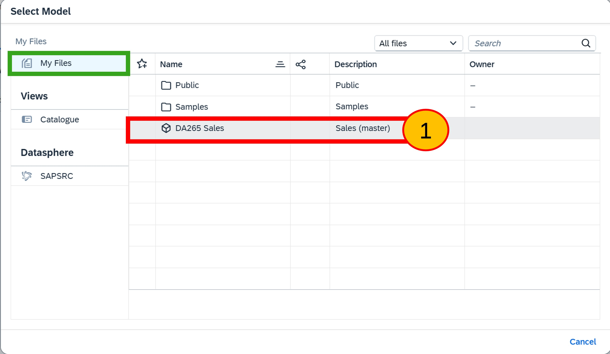

 
 
 
 

### Step 33: Indexing in progress
**No action**.

Please be patient whilst your model is being indexed.

> In a workshop environment, it may also take longer than expected, so you may need to be patient and re-try.

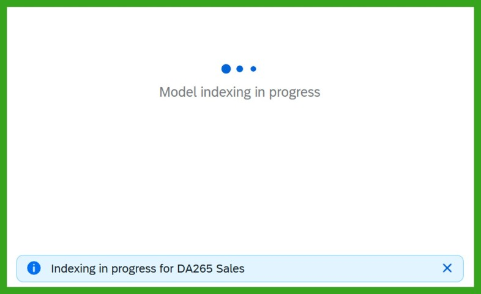
  

 
 
 
 

## Add synonym Profitable (measure)

Although we created a measure called 'profit', our users could ask for something like 'profitable states'. And whilst Just Ask can interpret many phases, it can’t identify 'profitable' as something that should involve 'profit'. So we need to add a synonym to 'Profit' measure.

### Step 34: Add 'profitable' as a synonym

1. Click the **+** under Synonyms for the measure **'Profit'**.

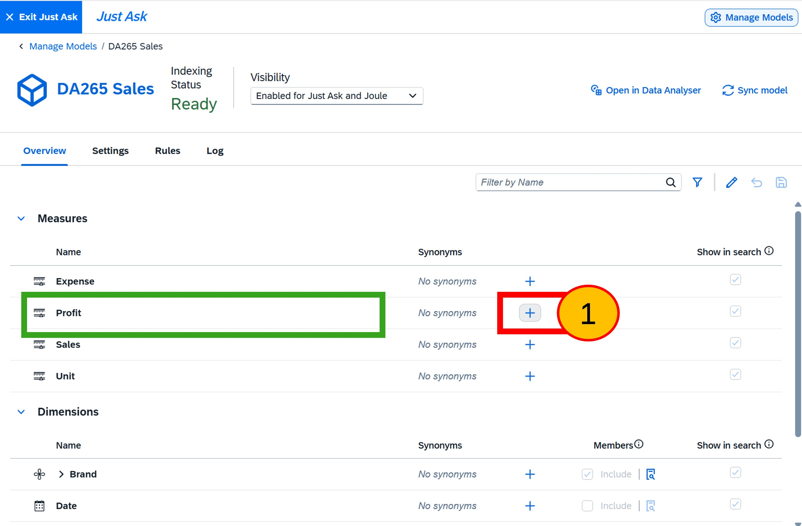
  

 
 
 
 

### Step 35: Add and save
  
1. Enter the word `profitable`
2. Click **Add**
3. Click **Save**
> Screenshot taken between steps 2 and 3

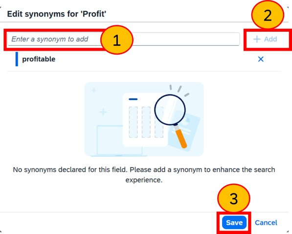
  

 
 
 
 

## Add synonyms for Unit (measure)

Although Just Ask can identify 'Units' as meaning 'Unit', it cannot recognize that users might use this unit of measure as the business term for the unit.  

 
 

### Step 36: Add 'PC, PCs' as synonyms
1. Click the **+** under Synonyms for the measure **'Unit'**.

  

 
 
 
 

### Step 37: Add PC and PCs as synonyms for Unit
  
1. Enter `PC`
2. Click **Add**
3. Enter `PCs`
4. Click **Add**
5. Click **Save**

> Screenshot taken between steps 3 and 4

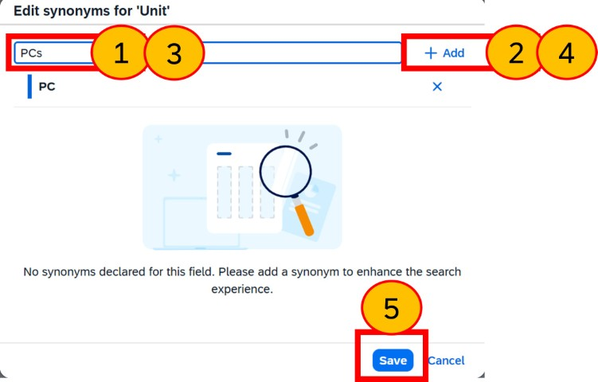
  

 
 
 
 

### Step 38: No action.
  
**No action**

Validate that the synonyms added are correct.

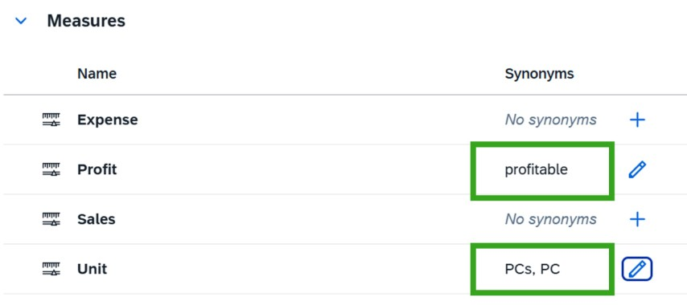
  

 
 
 
 

  
## Add synonyms for Store member values (dimension values)

Our business users, you may recall, would like to ‘grocery’ to refer to both ‘mid-size’ and ‘small’ groceries and they would like to avoid the need to repeatedly correct the filter that Just Ask creates for them.

 
 

### Step 39: Dimension members list
1. Click on **View** under 'members' to open the dimension value list for the ***Store*** dimension

  

 
 
 
 

### Step 40: Mid-size grocery
1. Click on the edit synonyms for 'Mid-Size Grocery'

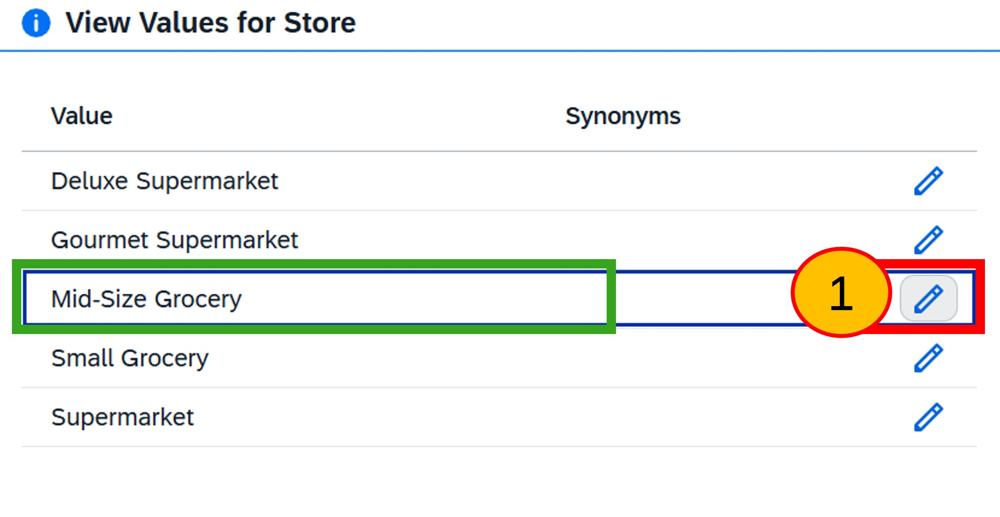
  

 
 
 
 

### Step 41: Add 'grocery' to member value
  
1. Enter the word `grocery`
2. Click **Add**
3. Click **Save**
> Screenshot taken between steps 2 and 3

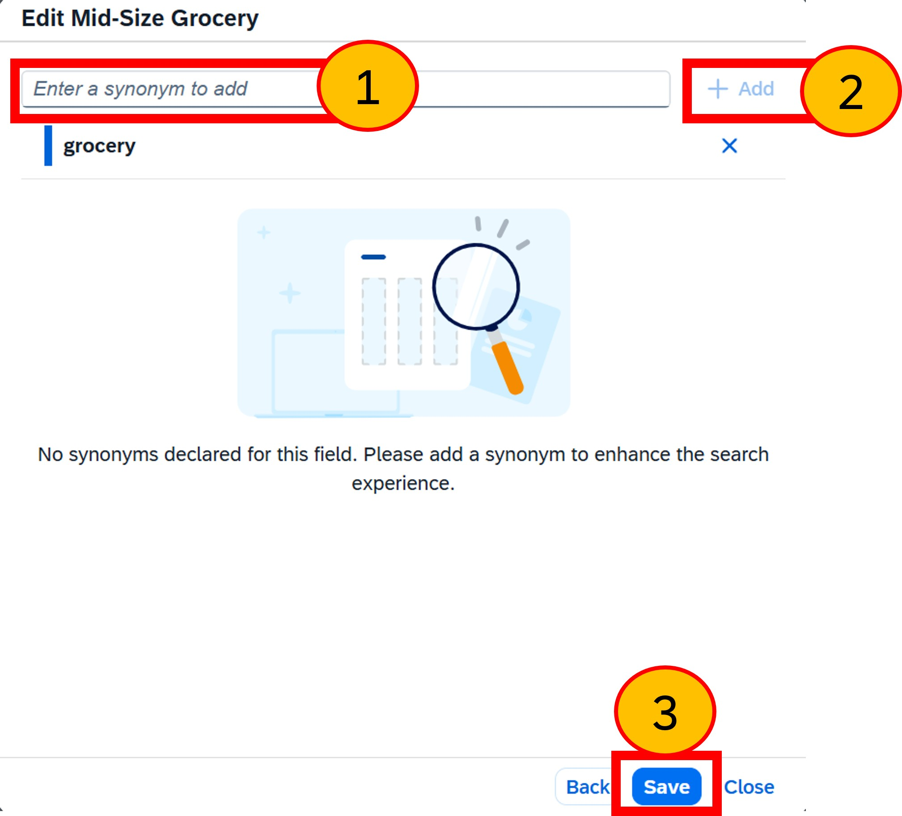
  

 
 
 
 

### Step 42: Dimension members list (again)

1. Click on **View** under 'members' (again) to open the dimension value list for the ***Store*** dimension

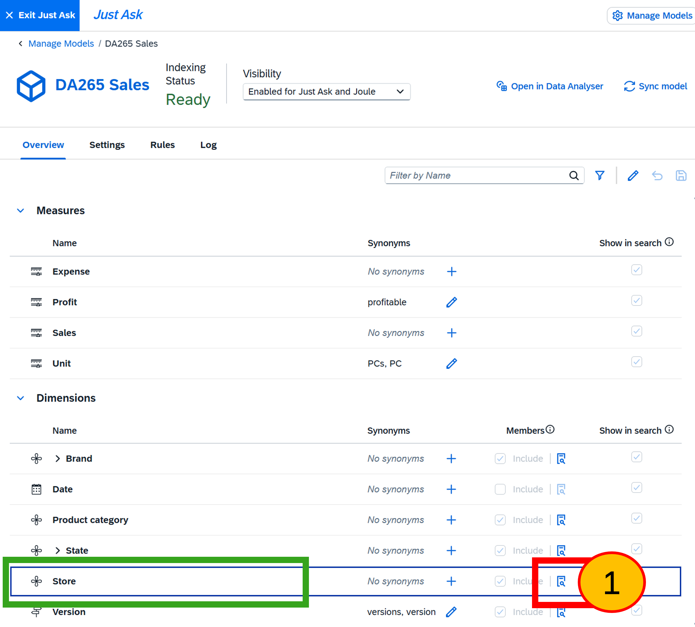
  

 
 
 
 

### Step 43: Small Grocery
1. This time, click on the **edit** synonyms for 'Small Grocery'

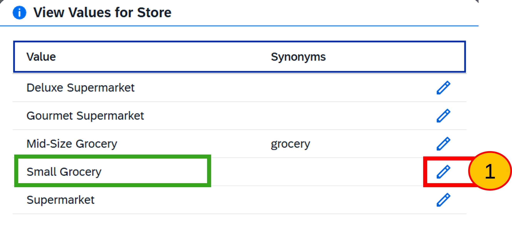
  

 
 
 
 

### Step 41: Add 'grocery' to member value
  
1. Enter the word `grocery`
2. Click **Add**
3. Click **Save**
> Screenshot taken between steps 2 and 3

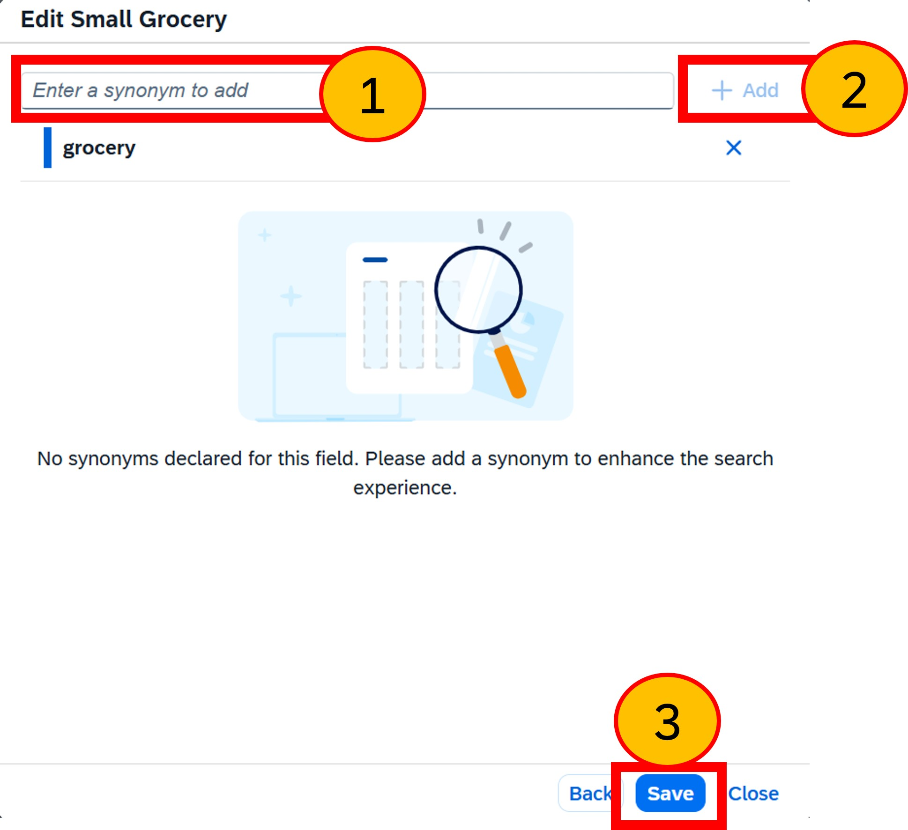
  

 
 
 
 

### Step 42: Check Store synonyms
1. Click **View** under 'members' (yet again) to open the dimension value list for the third time.

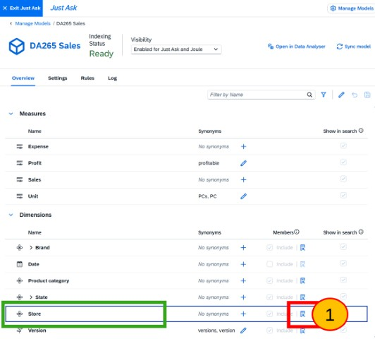
  

 
 
 
 

### Step 43: 
  Observe that 'grocery' is used twice for two different values. This means 'grocery' will be used to mean both values, just as the business users want it to be.
  
1. Click **Close**.

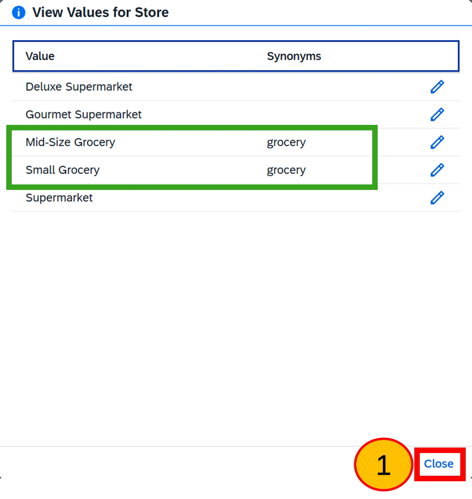
  

 
 
 
 

## Setting default measure, time period, alias and labels.

If users do not specify a measure, we will set a default measure. Similarly, we will define a default time period, called the 'auto-inject Time Period' in Just Ask. This means that if no time period is specified, a standard one will be used. For example, if a user asks for 'sales' without specifying a time frame, we might default to the current year instead of all years.

To improve model selection, we will also add a model alias and a model label to help Just Ask identify the appropriate model more easily. 

 
 

### Step 44: Settings
  
1. Select **Settings**
2. Change the Model alias to `TechEd`
3. Change the Model Label to **TechEd**
4. Change the default measure to **Sales**
5. Select (check) the option ***'Auto-inject Time Period'***
6. For the 'Time Period' select **Current**
7. ... then **Year**
8. Press **Save**

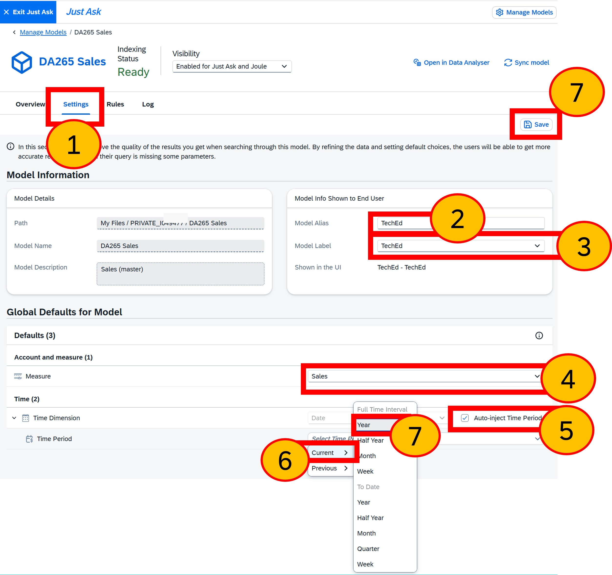
  

 
 
 
 

## Adding rules

Rules can help Just Ask to present the correct visualisation. 
  
In our case, the business users have told us:
  
- Whenever they use the measure *unit* they always want to see this over time, or by time.
- Whenever the dimension *State* is used, then ‘Country’ should also be included.
  
Thanks to rules, we help our users and reduce repeated effort on their part.

 
 

### Step 45: Add rules
  
1. Select **Rules**
2. Click **Add Rules**

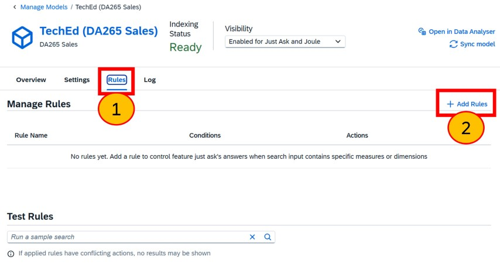
  

 
 
 
 

### Step 46: Date and Unit 
#### This is part 1 of 3:
  
1. In the 'rule name' enter `add date when using unit`
2. In the 'When Search Contains' Select **Any of Measures (OR)**
3. Select **Unit**
4. Press **Next**

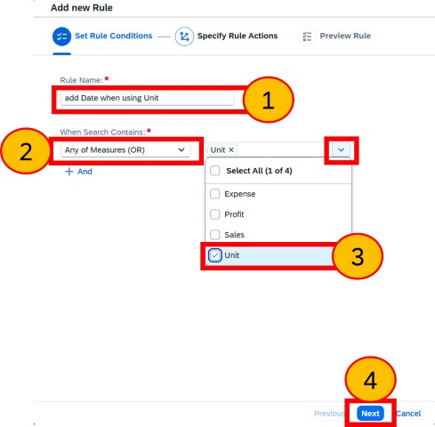
  

 
 
 
 

#### This is part 2 of 3:
  
1. In the Include Measure or Dimension, click **Add**
2. Under 'Select an object' select **Date**
3. Press **Next**

> If the list of available measures and dimensions is not shown, then cancel this workflow. Next, select 'Manage Models' and re-select this model before repeating from step 45. Please also inform your SAP representative so we are aware if this issue persists.

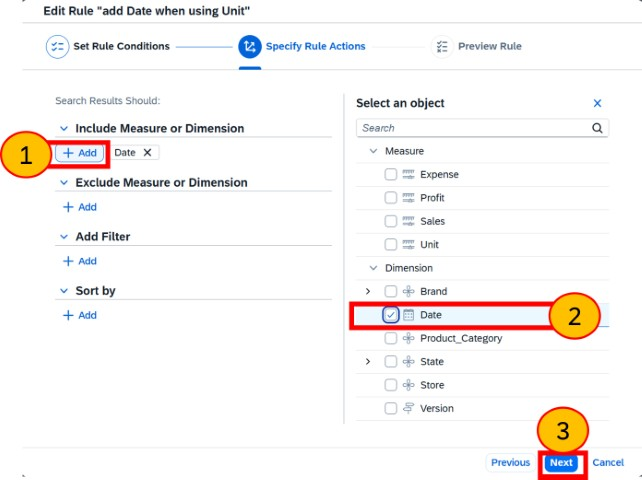

 
 
 
 

#### This is part 3 of 3:
  
1. **No action**. Observe the summary is correct
2. Press **Save**

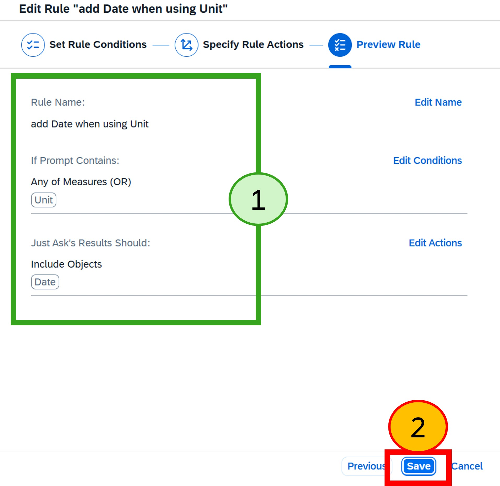

 
 
 
 

### Step 47: State and Country

Similarly add the next rule, but this is for State. Click **Add Rules**

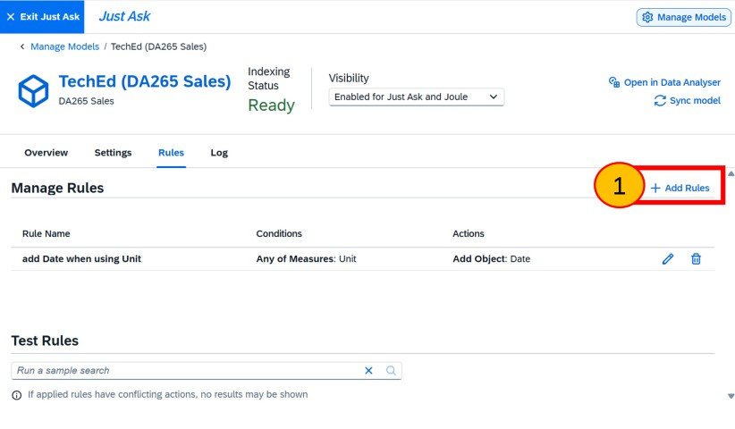

 
 
 
 

#### This is part 1 of 3:
  
1.	In the 'rule name' enter `When dimension State is used include country`
2.	In the 'When Search Contains' Select **Selected Dimensions (AND)**
3.	Select **State**
4.	Press **Next**

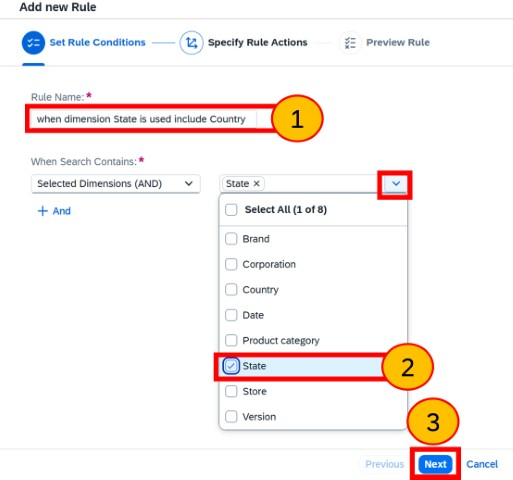

 
 
 
 

#### This is part 2 of 3:
  
1.	In the 'Include Measure or Dimension', click **Add**
2.	Under 'Select an object' select **Country**
3.	Press **Next**

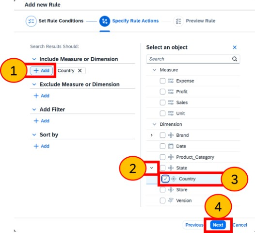

 
 
 
 

#### This is part 3 of 3:
  
1.	**No action**. Observe the summary is correct
2.	Press **Save**

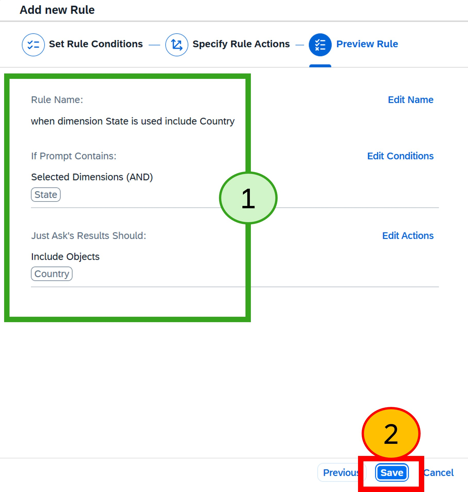

 
 
 
 

### Step 48: Check rules
  Observe the summary is correct.

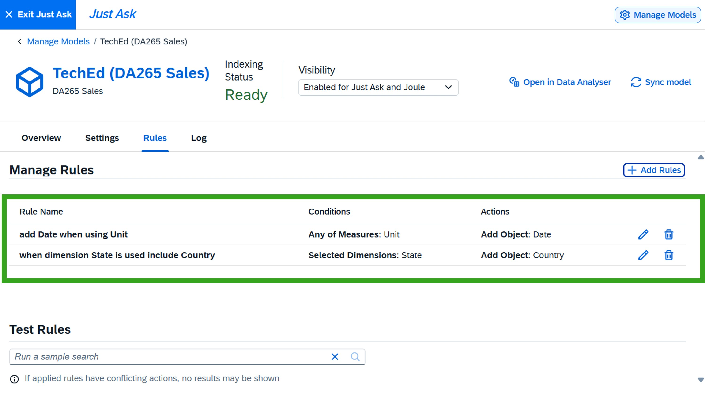

 
 
 
 

### Step 49: Close manage models
1. Close the 'Manage Models' page by clicking **Manage Models**
> Screenshot taken before this step

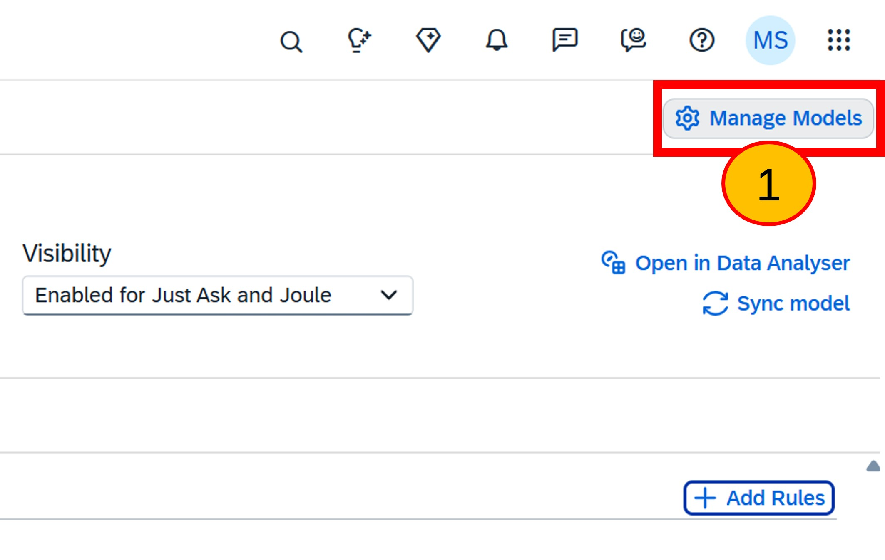

 
 
 
 

## Validate enhanced model

### Step 50: Test new calculated measure, and country/state rule
  
Now we have created these rules, as well as the synonyms, we can test them:
  
1. Return to the Just Ask home page by clicking **Just Ask**
2. Open the model selection drop-down menu
3. Select **'Remove Model Selection'**. It will mean no particular model will be used, instead our question will be asked of both models.
4. Observe that no particular model has been selected. It means we can ask the same question to both and observe the difference between the two.
5. In the search box, enter the question `profitable states`
6. Press **enter**, or click **Ask**

  
You may also have observed that 'Profitable' is using the new measure you recently created called 'Profit'.

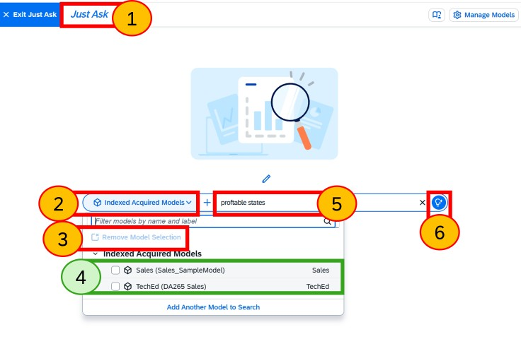

 
 
 
 

### Step 51: Validating profitable and country/state rule

> when multiple models return results, the sequence of the visualisations is somewhat ambiguous

#### For the visualisation for the model **DA265 Sales**:
1. No action. Observe the default time period has been set to the **Current Year (Full Time)**
2. No action. Observe the 'Country' state has been added, helping the users understand which state belongs to which country. Country is really just a property of State. This has helped validate one of the rules we created earlier.

#### For the visualisation for the model **Sales_SampleModel**:
3. No action. Observe that ***Sales*** has been used as the measure and not profit. This is because this model isn't aware of profit and so the default measure was used, in this case 'Sales'. 

#### Save as a predefined question:
4. Save this question by clicking **+ profitable states**

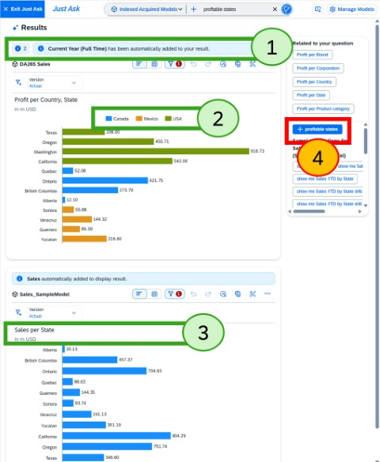

 
 
 
 

### Step 51: Save question to 'TechEd'
1. Select the model **TechEd (DA265 Sales)**
2. Click **Save**

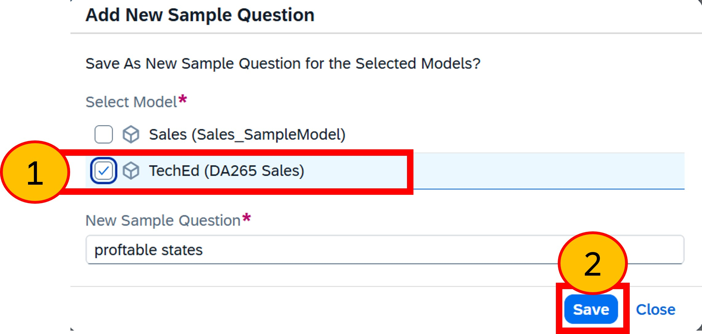

 
 
 
 

### Step 52: Validating PCs alias and date rule
1. In the search box, enter the question `PCs by brand`
2. Press **enter**, or click **Ask**
3. No action. Note that although no specific model was created, allowing both models to potentially produce results, only one model did. This is because only one model could understand 'PCs'.
4. No action. Observe the default time period has been set.
5. No action. Note that the ***Date*** dimension was added to the visualisation because our rule inserts the date whenever 'Unit' is used. We happened to refer to the Unit as 'PCs'.
6. Save this question by clicking **+ PCs by brand**

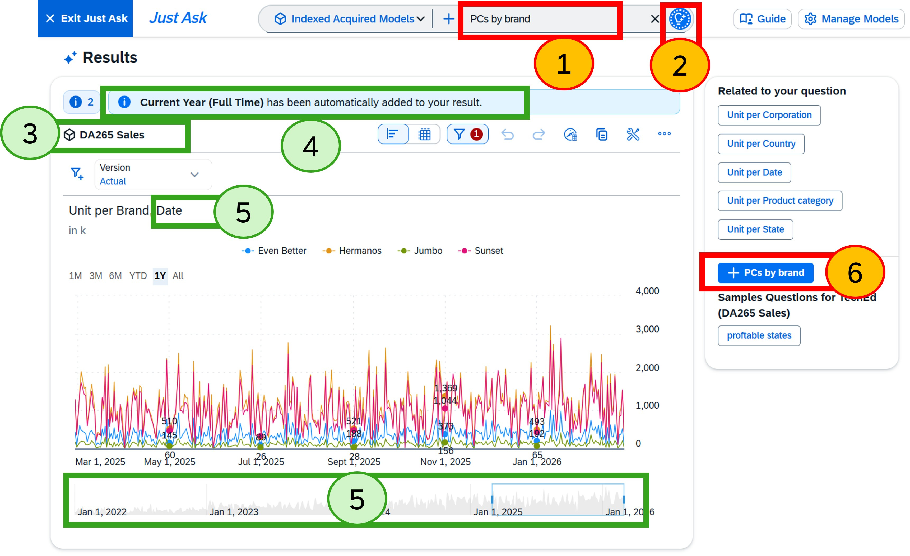

### Step 53: Save question to 'TechEd'
> There is no need to choose a model this time as only one model returned a result.
1. Click **Save**

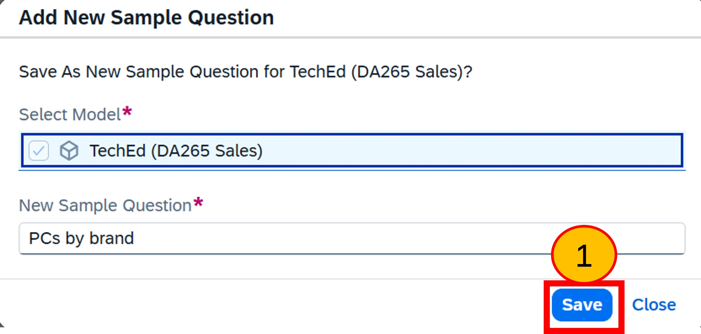

 
 
 
 

### Step 54: Validating dimension member value synonyms
1. Open the **Model Selection** drop-down box
2. Select, check, the model **TechEd (DA265 Sales)**
3. In the search box, enter the question `grocery store sales`
4. Press **enter**, or click **Ask**

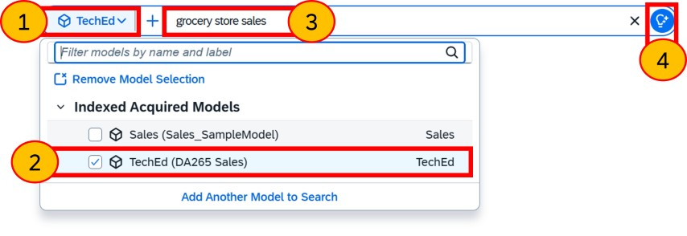

 
 
 
 

### Step 55: Validating Grocery stores

1. Click on **Store** to open the pop-up window.
2. No action. Observe that both mid-sized and small grocery stores are selected saving your users from repeatedly re-selecting the one previously missed.
3. Save this question by clicking **+ grocery store sales**

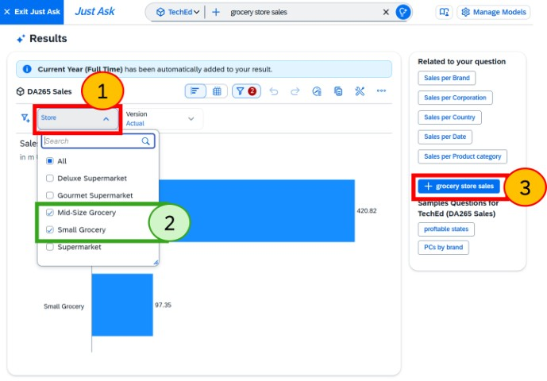

 
 
 
 

### Step 56: Save question to 'TechEd'
1. Click **Save**

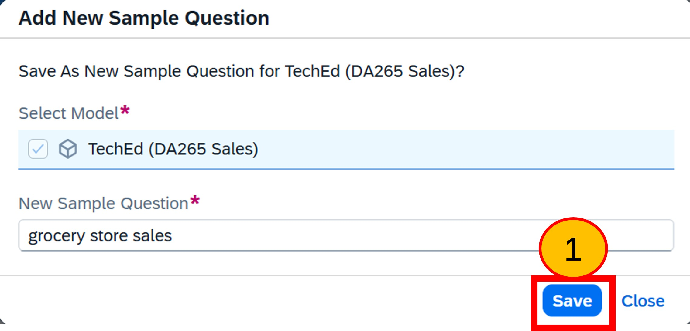

### Step 57: Validating Country dimension values
Our users could not recognise that Country was a dimension and that the State included values which were Countries. We will now explore how our improved model will reveal the new country property added to the State dimension.

1. Click **X** to clear the search box.

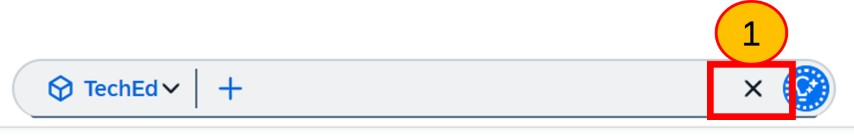

 
 
 
 

### Step 58: model structure enhanced
1. Click on **+** to expose the model structure (as seen by the users)
2. No action. Observe that 'Profit' is listed, this is our calculated measure.
3. Select **Country**. This is a new property that was previously not available. It means our users can now see and ask questions 'by country'.

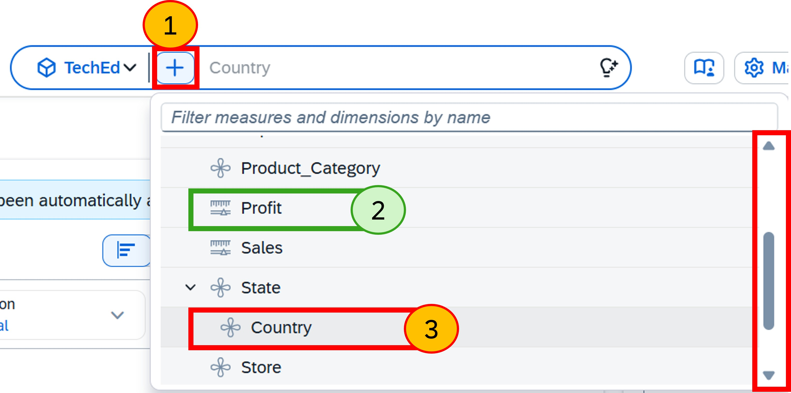

 
 
 
 

### Step 59: Validating new Country dimension

1. Observe from the drop-down list of values that three countries are listed. These are the three unique values from our new property Country_
2. Select the measure **sales**
3. Press **enter**, or click **Ask**

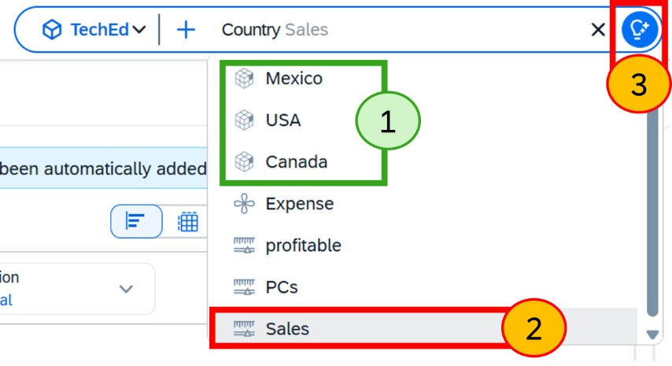

 
 
 
 

### Step 60: Country is now a dimension

1. Observe the countries are now shown as a unique dimension.
2. Save this question by clicking **+ Country Sales**

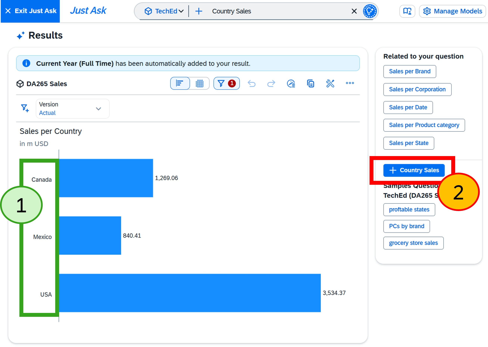

 
 
 
 

  
### Step 61: Save question to 'TechEd'
  
1. Click **Save**

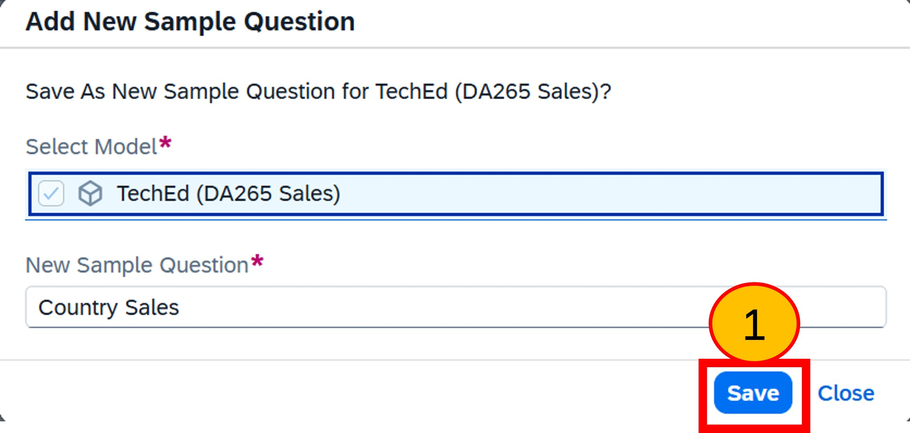

 
 
 
 

### Step 62: Exit Just Ask
  
1. Click **Exit Just AsK**
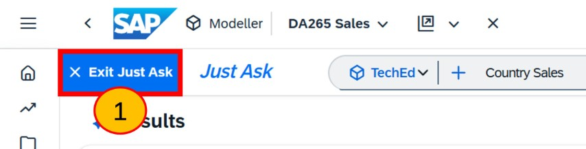

 
 
 
 

## Summary

You now understand how and when to improve an existing model to enhance user experience, specifically by:
+ Creating new measures to address user needs
+ Adding new metadata to existing dimensions, especially to hierarchies, allowing just ask to expose such improved hierarchies
+ Including synonyms, which is essential for easier identification of measures, dimensions, and for filtering multiple values within a single dimension
+ Using rules to add dimensions to visualisations, thereby enriching the visual context 

Additionally,
+ How Joule can act as your co-pilot to assist in identifying tasks and relevant documentation, saving you time and enabling you to focus more on your tasks.

### Next exercise

Continue to - [Exercise 5 - Understanding Indexing](../ex5/README.md)
