# Exercise 5 - Understanding Indexing

## Overview

### Persona

You are a Just Ask administrator with basic SAP Analytics Cloud modelling skills. 
### Objective
+ Understand the various types of metadata stored by Just Ask and recognise situations where disabling specific value storage is vital for data privacy
+ Additionally, learn when re-syncing a model is needed to ensure Just Ask updates its metadata with the latest values and evaluate the impact on users of the ‘just ask’ feature.

## Instructions

We estimate these instructions will take about 10 minutes to complete.

## Updating model dimension values

### Step 1: Open Brand Dimension

> [!NOTE]
> The model should already be open from an earlier exercise. If not, please open your copied model 'DA256 Sales' from the root of 'My Files'
1. Select the **Model Structure**
2. No action. Validate that the model is the correct model 'DA265 Sales'
2. Click on the **Edit Dimension Table** for the ***Brand*** dimesnion

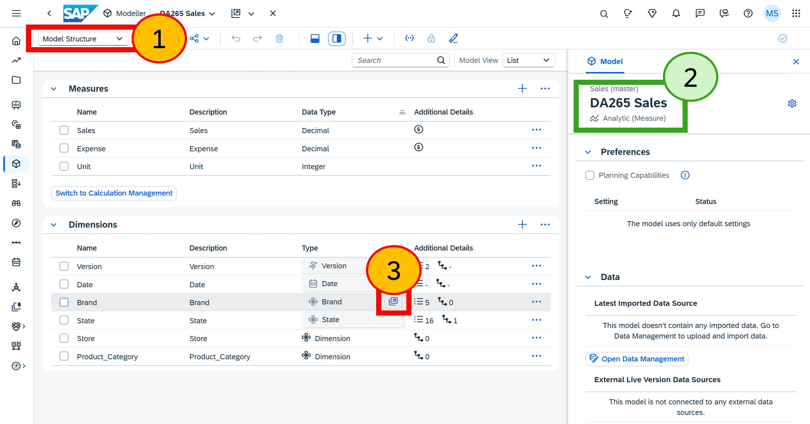
  

 
 
 
 

### Step 2: Rename 'Global Essence Group' to 'Global Essence Inc', open Just Ask
  
1. Rename the 'Corporation' value for 'Even Better' from '**Global Essence Group**' to `Global Essence Inc`
2. Rename the 'Corporation' value for 'Hermanos' from '**Global Essence Group**' to `Global Essence Inc`
3. Click **Save**.
4. Open Just Ask by clicking on the **Just Ask** icon.

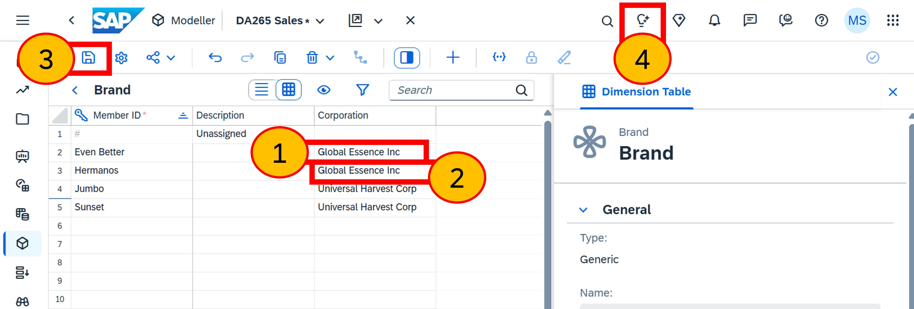
  

 
 
 
 

### Step 3: Old values shown by Just Ask

1. Click on the **Just Ask** logo to show the home page
2. Click on the **+** icon and select **Corporation**
3. Observe the list of values shown include the old value 'Global Essence Group' and not the updated value 'Global Essence Inc'

> Screenshot taken between steps 2 and 3

It means that we need to re-sync the model for these new values to be shown within the Just Ask interface.

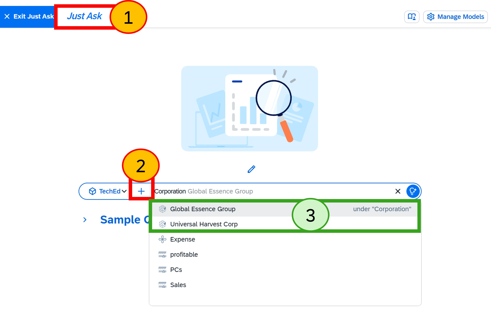
  

 
 
 
 

## Re-sync model

### Step 4: Open TechEd model
  
1. Select **Manage Models**
2. Select the **TechEd (DA265 Sales)** model

 

 
 
 
 

### Step 5: Sync-model

1. Click **Sync model**
  
Re-syncing the model will re-index the values. It will also re-read the data structures and any other changes you've made, such as adding calculated measures. 

> [!TIP]
> We don't need to manually trigger Just Ask to re-sync, as it happens automatically behind the scenes. When a model is updated, Just Ask places it in a queue for re-syncing. In a workshop setting, since we can't afford to wait, we'll manually force a re-sync.

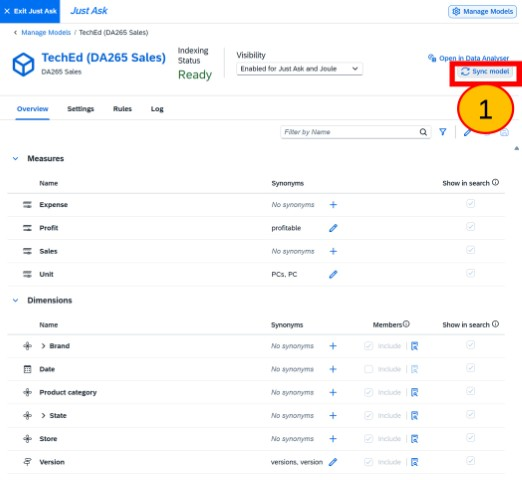
  

 
 
 
 

### Step 6: Confirm
  
Sometimes the model synchronisation takes a long time, so it's handy to have the option to cancel if you accidentally press ‘sync’
  
1.	Click **Sync model**

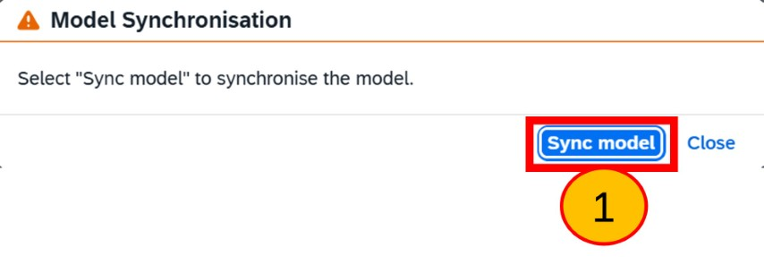

 
 
 
 

### Step 7: Indexing in progress
  
No action. Please be patient while the model is re-indexed.
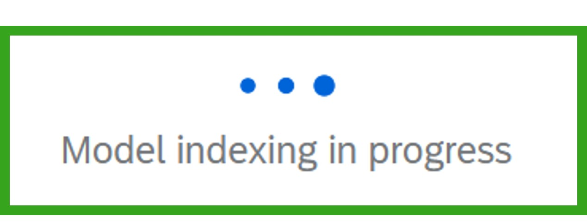

 
 
 
 

### Step 8: Exit manage models
  
1. Close the Manage Models page by clicking **Manage Models**

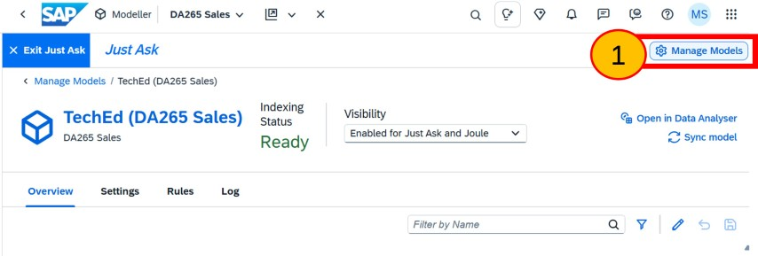

 
 
 
 

### Step 9: Re-test
  
1. Click on the **+** icon and select **Corporation**
2. Note that the list of values now includes the newly updated value, 'Global Essence Inc.'

> Screenshot taken between steps 2 and 3

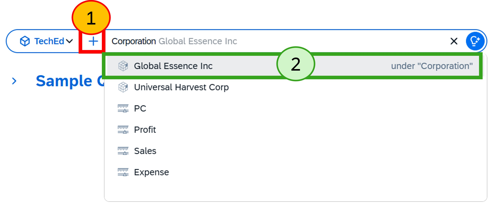

 
 
 
 

## Hiding sensitive dimension values

Let's explore how Just Ask can securely share sensitive dimension values, ensuring they are not visible to all users accessing the model. Next, we will modify a setting in the Just Ask model to hide these values and examine the effect on the user experience.

You have just seen how Just Ask stores a copy of the dimension values to help users explore the data model without needing to query the database directly. However, these values are visible to all users with access to Just Ask and the data model.

If there are data access or privacy controls that restrict these values for certain users, we need to prevent Just Ask from displaying them. This involves configuring Just Ask to exclude importing the dimension member values for the dimension.

Although we have access to all dimension member values, as the model owner, the business has decided that the ‘Corporation’ values should be hidden from specific users via data access or privacy controls. trol. 

### Step 10: Open TechEd model
  
1. Select **Manage Models**
2. Select the **TechEd (DA265 Sales)** model

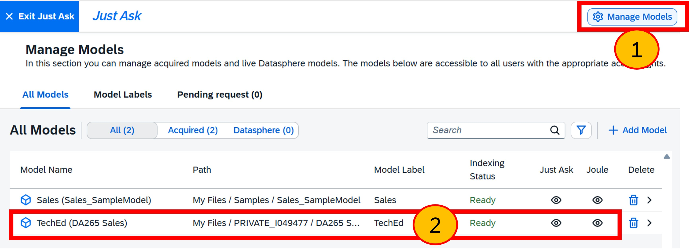

 
 
 
 

### Step 11: Disable members for Corporation
  
1. Click the **Edit show in search preferences** icon
2. For the **'Corporation'** dimension de-select the **include** under 'Members'
3. Click **Save**

> [!TIP]
> The 'Show in search' option is very useful.
> + When you remove a dimension from the search, it no longer appears in Just Ask. This helps simplify what users see and avoids confusion between similar measures, dimensions, or their values. 
> + We will not disable this 'Show in search' option in this workshop but for real-life models you are likely to need it.

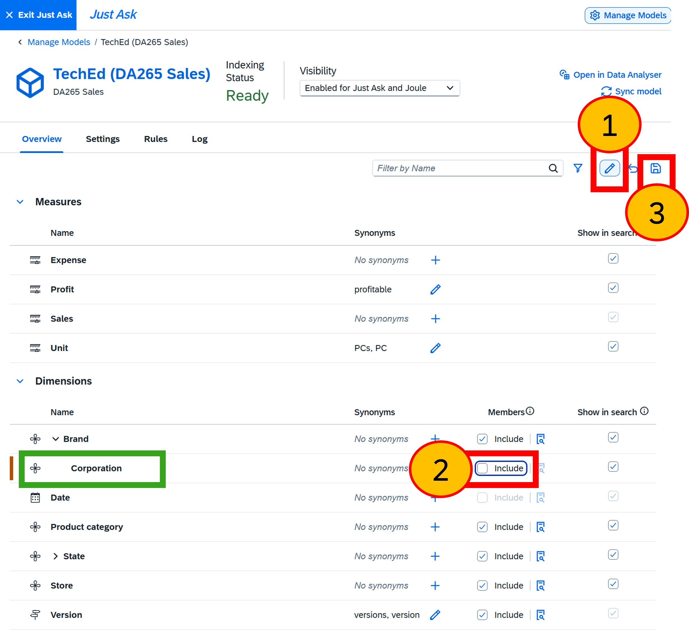

 
 
 
 

### Step 12: Confirm save
  
1. Click **Save**

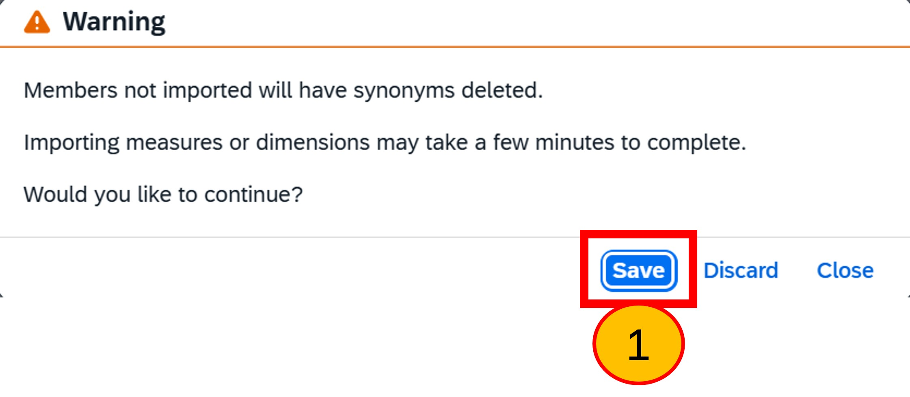

 
 
 
 

### Step 13: Test
  
1. Close the Manage Models page by clicking **Manage Models**
2. Click on the **+** icon and select **Corporation**
3. Note that no longer are there any values displayed for Corporation. Users can still filter values; they just need to type the value instead of selecting it from a list. Removing the list in Just Ask simply prevents these values from appearing in the interface.
4. Click **Exit Just Ask**

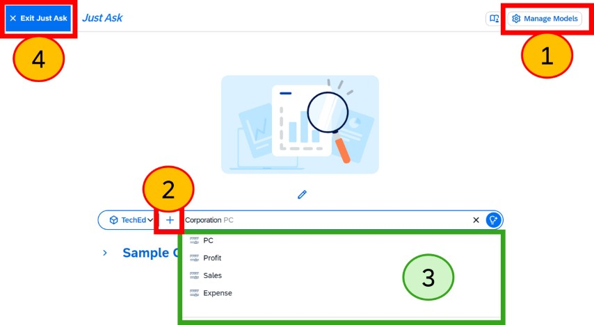

 
 
 
 

## Summary

You now understand the different types of metadata stored by Just Ask, specifically:
+ Dimension values are imported by Just Ask and managed separately from the model, meaning a re-sync is required when the data model values change.
+ Sensitive dimensions, especially those governed by data privacy or access controls, should not be imported.
+ Model measures and dimensions can be entirely hidden from Just Ask to simplify user experience and reduce confusion.

### Next exercise

Continue to - [Exercise 6 - Comparing Joule inside and outside SAP Analytics Cloud](../ex6/README.md)
