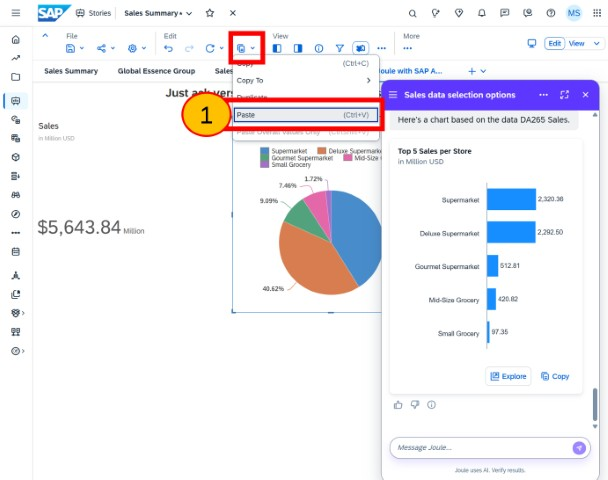

# Exercise 6 - Comparing 'Joule Analytical Insights' with 'Just Ask'

...coming soon.

Joule inside SAP Analytics Cloud is referred to as 'Joule Analytical Insights'.

## Joule Analytical Insights (this is currently in beta)

coming soon.

### Step 1: Open Story in edit mode

1. Click to **Expand the navigation bar**
2. Select **Files**
3. For the ***'Sales Summary'*** Story, click **...** and **Open in Story Edit Mode**

  

 
 
 
 

### Step 2: Open a page and access Joule (beta)

1. Click to **Collapse the navigation bar**
2. Select the page ***'Just ask v Joule with Just Ask'*** 
3. Click the ***Joule*** icon to open Joule
4. Click the **Menu**
5. Click to add a **New Conversation**

> It’s important to note that Joule Analytical Insights is currently in beta and not generally available. This means some features are not yet complete, and you may encounter a few anomalies and issues.

 
 
 
 

### Step 3: Show me sales

1. Enter `show me sales` 
2. Press enter or click **send**

  

 
 
 
 

### Step 4: Select DA265 at the prompt

As two models can answer this question on ‘show me sales’, Joule needs to prompt which one should be used for the analytical insight.

Two models are displayed: the original sample model and your now-enhanced copy, called **‘DA265 Sales’**. This model also has an alias of **‘TechEd’** and a label also called **‘TechEd’**

  
1. Select **DA265 Sales**

 

 
 
 
 

### Step 5: Question avoiding the model prompt

We can avoid the prompt by telling Joule which model to use by adding `for DA265` to the question.

1. Enter `show me sales for da265` 
2. Press enter or click **send**
  
> With 'Joule Analytical Insights' (Joule within SAP Analytics Cloud), we currently identify the model by its name rather than its alias. Since this feature is in beta, this behaviour might change in the future to align with Joule when accessed outside of SAP Analytics Cloud. Later in this workshop, you'll access Joule outside of SAP Analytics Cloud and refer to the model by its alias, which for us is 'TechEd'.

> In summary, for 'Joule Analytical Insights' (Joule within SAP Analytics Cloud) you’ll refer to the model with ‘for DA265’ and for Joule with ‘for TechEd’.

  

 
 
 
 

### Step 6: Copy-paste, ask another question
  
With Joule Analytical Insights we can easily copy and paste any visualisation into a Story.
  
1. Click **Copy**
2. Select **Paste** which will paste the visualisation from Joule Analytical Insights into our story.
3. Enter `show me sales by store for da265` 
4. Press enter or click **send**

 
 
 
 

### Step 7: Explore Joule Analytical Insights
  
Joule Analytical Insights also enables us to explore the visualisation and enhance it as we see fit.  Whilst we could just ask for a pie-chart, we shall explore to see the benefits.

1. Click **Explore**

 
 
 
 

### Step 8: Exit manage models
  
1. Click **Edit Chart**
2. Change the Chart to **Pie**
3. Click **Copy** to copy this chart
4. Click **Close**

 
 
 
 

### Step 9: Paste into Story
  
1. Click on the **Paste** icon to paste the visualisation we *enhanced(!)* from Joule Analytical Insights

 
 
 
 

## Summary

coming soon!

Continue to - [Exercise 3 - Excercise 3 ](../ex3/README.md)
