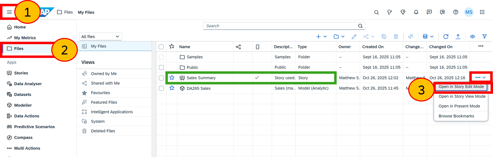
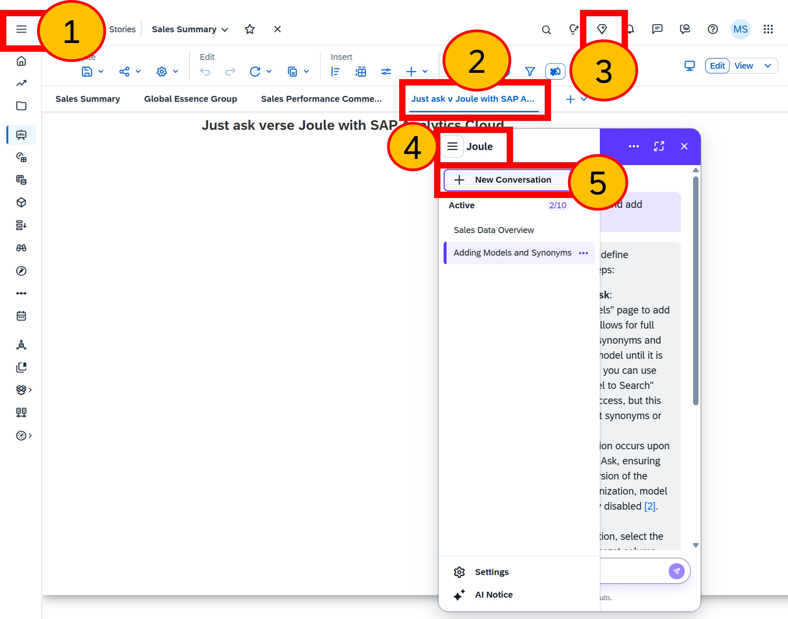
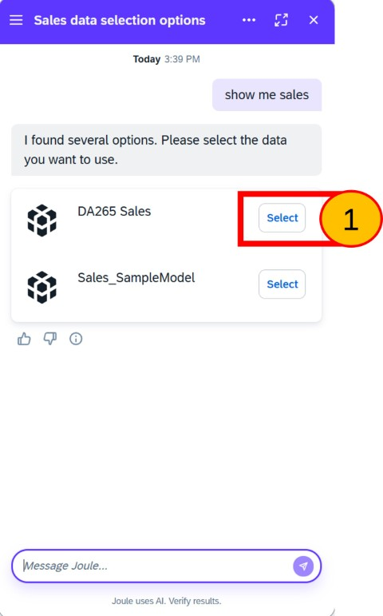
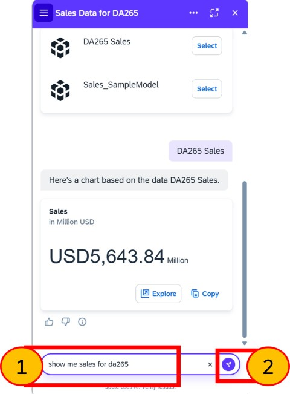
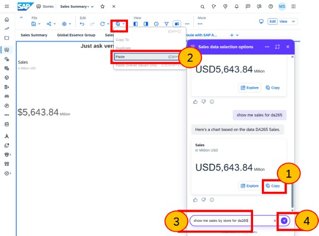
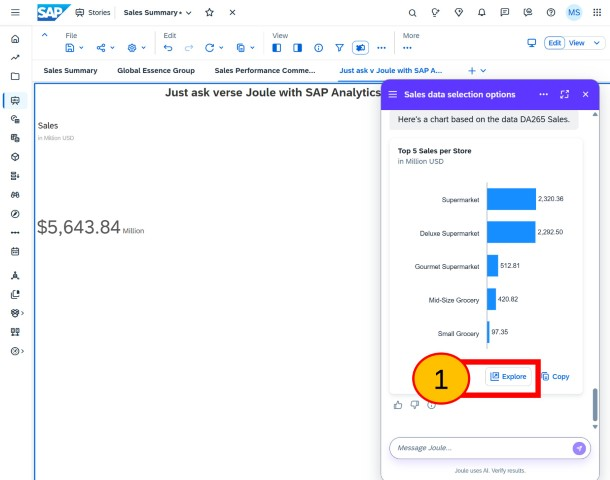
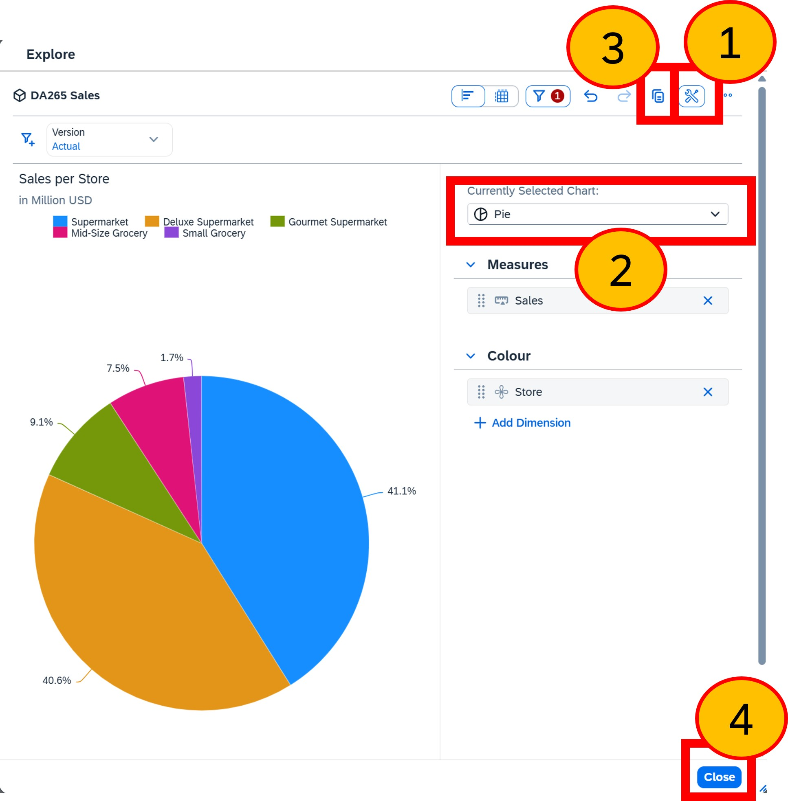

# Exercise 6 - Comparing 'Joule Analytical Insights' with 'Just Ask'

...coming soon.

## Joule Analytical Insights

coming soon.

### Step 1: Open Story in edit mode

1. Click to **Expand the navigation bar**
2. Select **Files**
3. For the ***'Sales Summary'*** Story, click **...** and **Open in Story Edit Mode**

  

 
 
 
 

### Step 2: Open a page and access Joule

1. Click to **Collapse the navigation bar**
2. Select the page ***'Just ask v Joule with Just Ask'*** 
3. Click the ***Joule*** icon to open Joule
4. Click the **Menu**
5. Click to add a **New Conversation**

  

 
 
 
 

### Step 3: Old values shown by Just Ask

1. Enter `show me sales` 
2. Press enter or click **send**

  

 
 
 
 

### Step 4: Select DA265 at the prompt

As two models can answer this question on ‘show me sales’, Joule needs to prompt which one should be used for the analytical insight.

Two models are displayed: the original sample model and your now-enhanced copy, called **‘DA265 Sales’**. This model also has an alias of **‘TechEd’** and a label also called **‘TechEd’**

  
1. Select **DA265 Sales**

 

 
 
 
 

### Step 5: Question avoiding the model prompt

We can avoid the prompt by telling Joule which model to use by adding `for DA265` to the question.

1. Enter `show me sales for da265` 
2. Press enter or click **send**
  

  

 
 
 
 

### Step 6: Copy-paste, ask another question
  
With Joule Analytical Insights we can easily copy and paste any visualisation into a Story.
  
1. Click **Copy**
2. Select **Paste** which will paste the visualisation from Joule Analytical Insights into our story.
3. Enter `show me sales by store for da265` 
4. Press enter or click **send**

 
 
 
 

### Step 7: Explore Joule Analytical Insights
  
Joule Analytical Insights also enables us to explore the visualisation and enhance it as we see fit.  Whilst we could just ask for a pie-chart, we shall explore to see the benefits.

1. Click **Explore**

 
 
 
 

### Step 8: Exit manage models
  
1. Close the Manage Models page by clicking **Edit Chart**

 
 
 
 

### Step 9: Re-test
  
1. Click on the **+** icon and select **Corporation**
2. Note that the list of values now includes the newly updated value, 'Global Essence Inc.'

> Screenshot taken between steps 2 and 3

 
 
 
 

## Hiding sensitive dimension values

Let's explore how Just Ask can securely share sensitive dimension values, ensuring they are not visible to all users accessing the model. Next, we will modify a setting in the Just Ask model to hide these values and examine the effect on the user experience.

You have just seen how Just Ask stores a copy of the dimension values to help users explore the data model without needing to query the database directly. However, these values are visible to all users with access to Just Ask and the data model.

If there are data access or privacy controls that restrict these values for certain users, we need to prevent Just Ask from displaying them. This involves configuring Just Ask to exclude importing the dimension member values for the dimension.

Although we have access to all dimension member values, as the model owner, the business has decided that the ‘Corporation’ values should be hidden from specific users via data access or privacy controls. trol. 

### Step 10: Open TechEd model
  
1. Select **Manage Models**
2. Select the **TechEd (DA265 Sales)** model

 
 
 
 

### Step 11: Disable members for Corporation
  
1. Click the **Edit show in search preferences** icon
2. For the **'Corporation'** dimension de-select the **include** under 'Members'
3. Click **Save**

> The 'Show in search' option is very useful.
> + When you remove a dimension from the search, it no longer appears in Just Ask. This helps simplify what users see and avoids confusion between similar measures, dimensions, or their values. 
> + We will not disable this 'Show in search' option in this workshop but for real-life models you are likely to need it.

 
 
 
 

### Step 12: Confirm save
  
1. Click **Save**

 
 
 
 

### Step 13: Test
  
1. Close the Manage Models page by clicking **Manage Models**
2. Click on the **+** icon and select **Corporation**
3. Note that no longer are there any values displayed for Corporation. Users can still filter values; they just need to type the value instead of selecting it from a list. Removing the list in Just Ask simply prevents these values from appearing in the interface.
4. Click **Exit Just Ask**

 
 
 
 

## Summary

Continue to - [Exercise 3 - Excercise 3 ](../ex3/README.md)
