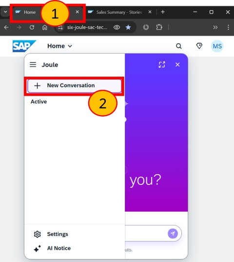
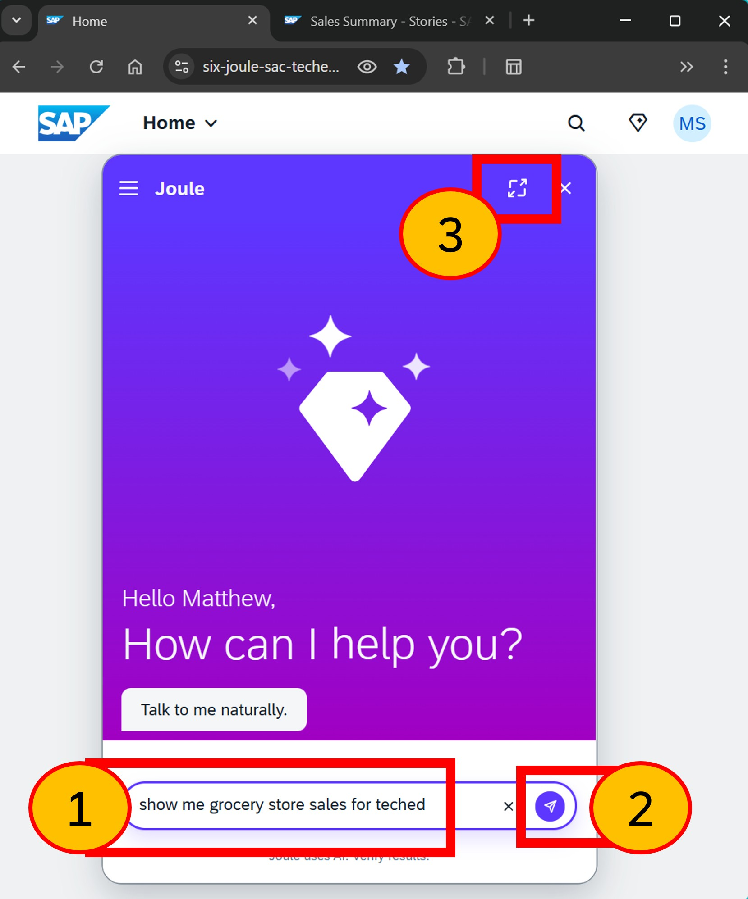
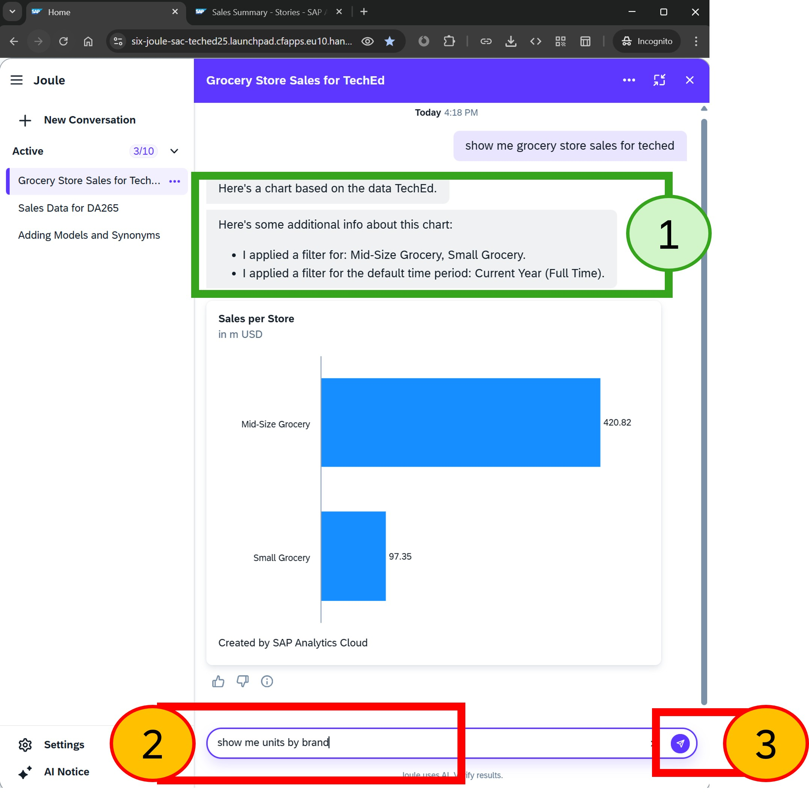
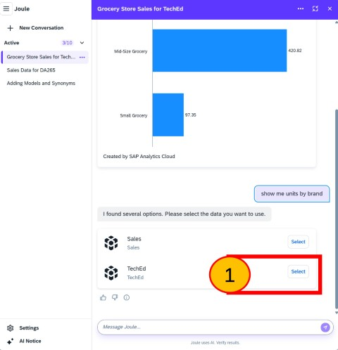
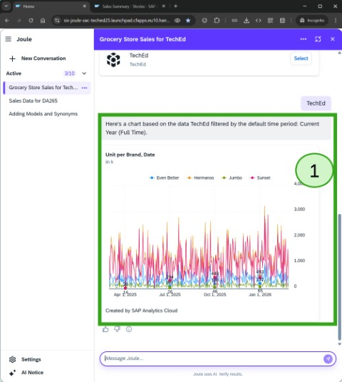
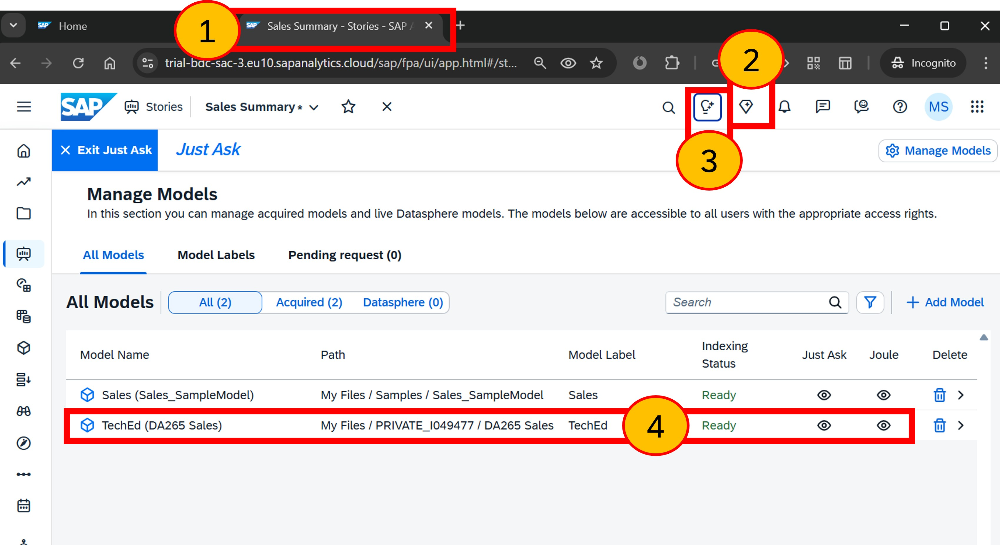
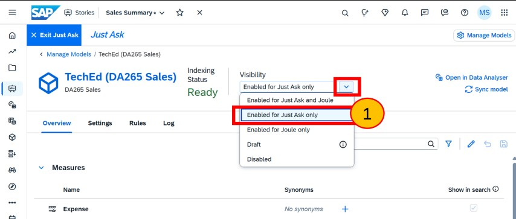
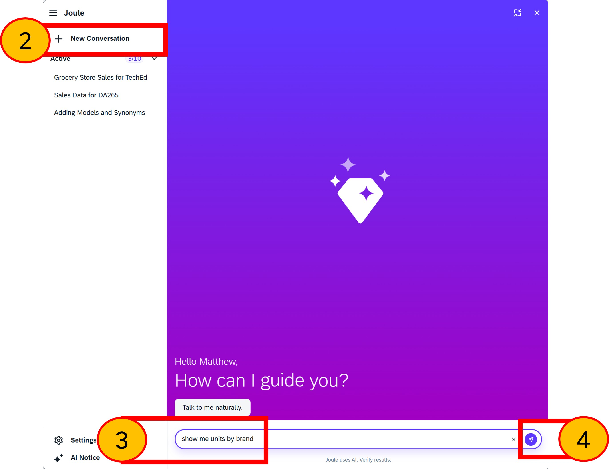
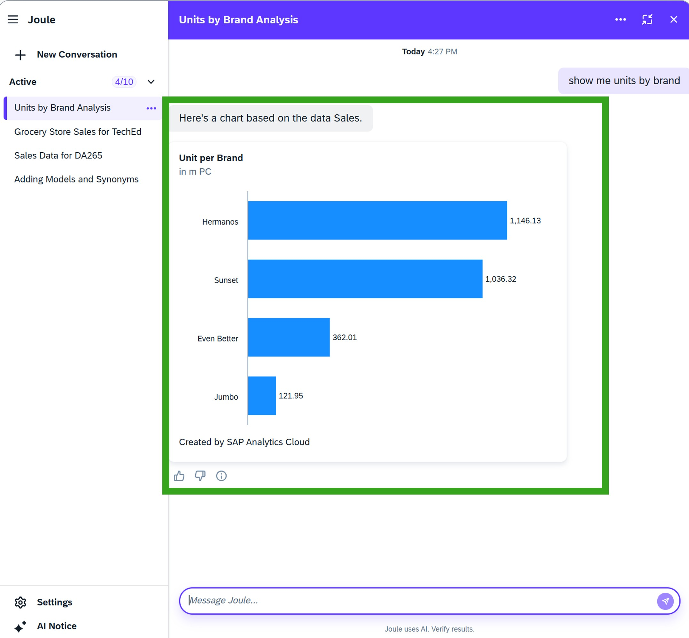

# Exercise 7 - Revisting Joule

...coming soon.

## Joule 

coming soon.

### Step 1: Switch to Joule in Workzone, start a new conversation

1. Click back to the browser **Workzone tab** 
2. Select **+ New Conversation**

  

 
 
 
 

### Step 2: Open a page and access Joule

1. Enter `show me grocery store sales for teched`
2. Press enter or click the **send** icon
3. Click **'Expand'** so we have more space to work.

> We used the term '***for teched***' to refer to our enchanced, copied, model. ***TechEd*** is the alias name for the model 'DA265'.
> The benefit of adding an alias and label to the model can be seen here. 

  

 
 
 
 

### Step 3: Validate synonyms, rules, and default time for the new model; pose a question to multiple models

1. There are several key points to note here. Each has improved the user experience:

	+ The model’s name has been confirmed back to you '**TechEd**'.
	+ The synonym for '*grocery*' has worked as a filter and has been applied to both grocery stores. The user didn't need to specify each store name individually. 
	+ The default time period has been applied, which means the sales correspond to the current year values, rather than all time.

2. Enter `show me units by brand` 
3. Press enter or click **send**

> Asking for 'units by brand' is a question that can be satisfied by both models, so we should expect a prompt.

  

 
 
 
 

### Step 4: Resolve prompt 'TechEd'

As two models can answer this question on ‘show me units by brand’, Joule needs to prompt which one should be used for the analytical insight.

Two models are displayed: the original sample model and your now-enhanced copy, shown here as **‘TechEd’**. This model also has an alias of **‘TechEd’** and a label with the same name, **‘TechEd’**. With Joule Analytical Insights' (Joule within SAP Analytics Cloud), the same model appears as **‘DA265 Sales’**. As mentioned, this behaviour may change once it's out of beta.

  
1. Select **TechEd**

 

 
 
 
 

### Step 5: Validate date rule has been applied

We can avoid the prompt by telling Joule which model to use by adding `for DA265` to the question.

1. Note that we requested Units. You might recall we added a rule for Units, so 'date' is always included. This results in a very busy and somewhat difficult-to-understand chart. It also indicates that considerations, such as rules, should be verified by the business user for both Just Ask and separately Joule. In some cases, you may need to limit options with Joule to prevent complex visualisations.
  

  

 
 
 
 

### Step 6: Open Model to limit access to Just Ask
  
In some instances, you might find that a model is simply too complex to be accessible through Joule. In such cases, we can disable a model for Joule access while still allowing Just Ask access. 
1. Click **SAP Analytics Cloud** browser tab
2. Close Joule for Analytical Insights by clicking the **Joule** icon.
3. Open Just Ask, by clicking the **Just Ask** icon
4. Open the model **TechEd (DA265 Sales)**

 
 
 
 

### Step 7: Disabled 'TechEd' for Joule
  

1. Change the visibility to **Enabled for Just Ask only**

 
 
 
 

### Step 8: Test TechEd is no longer visibile to Joule
  
1. Click back to the browser **Workzone tab** (not shown in screenshot)
2. Select **+ New Conversation**
3. Enter `show me units by brand` 
4. Press enter or click **send**

> This is the same prompt we used earlier resulted in Joule prompting for a model 

 
 
 
 

### Step 9: Check no prompt
  
1. Note the model **TechEd** is no longer available and so the result shown is from the 'Sales' model as described.

 
 
 
 

## Summary

Coming soon

Continue to - [Exercise 8 - AI-Assisted Commenting](../ex8/README.md)
