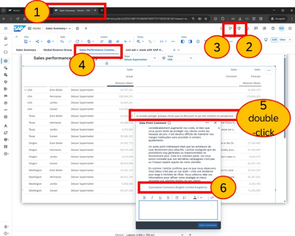
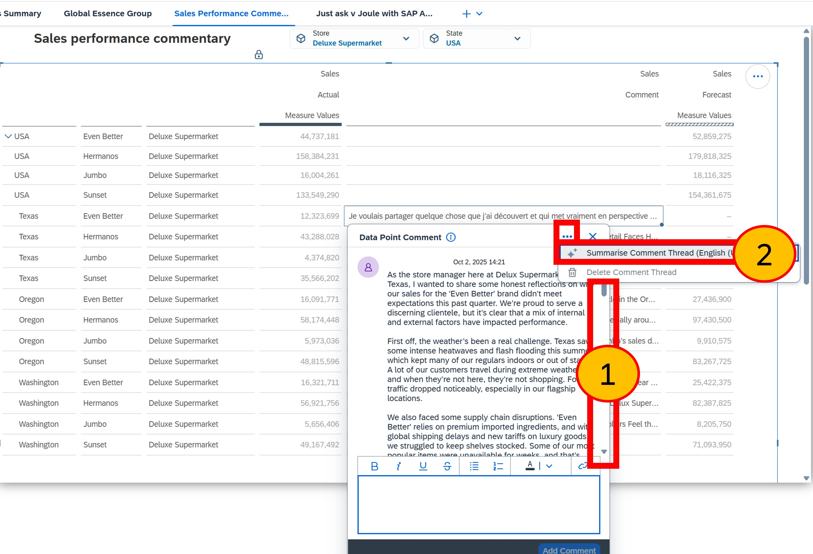
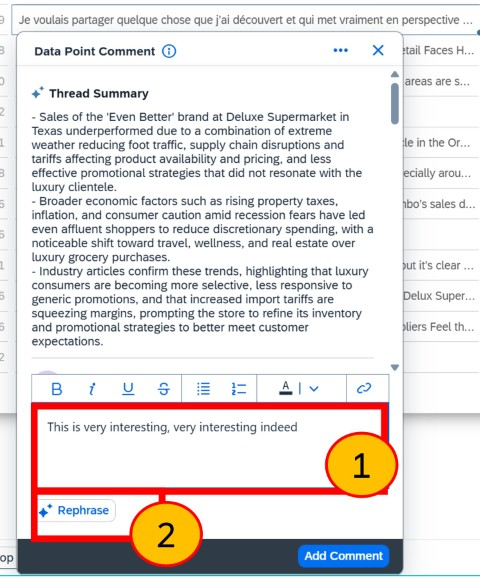
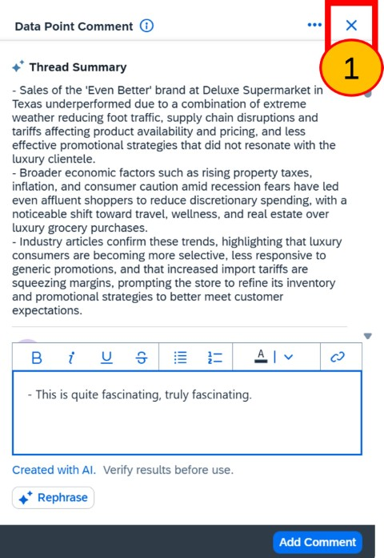
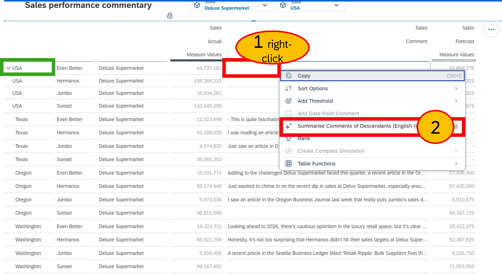
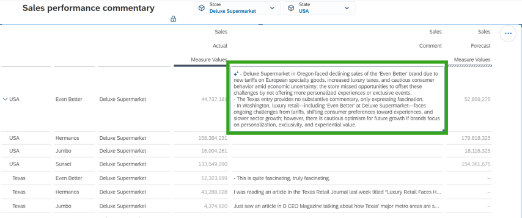

# Exercise 8 - AI-Assisted Commenting

## Overview

### Persona

You are an SAP Analytics Cloud planning user involved in the planning cycle. Your role includes adding and reviewing comments from stakeholders, often in different languages. Once a quarter, you summarise these comments and provide recommendations.

### Objective

Discover how easy it is to use generative AI and the AI-powered commentary feature in SAP Analytics Cloud, especially for summarising individual comments, extended comment threads, or hierarchically organised comments. This tool is especially helpful when comments are in a language different from yours.

## Instructions

We estimate these instructions will take about 10 minutes to complete.

### Step 1: Open comment thread and summarise the last long comment

1. Click back to the browser tab **SAP Analytics Cloud** 
2. Close Joule for Analytical Insights by clicking the **Joule** icon.
3. Close Just Ask, by clicking the **Just Ask** icon
4. Select the page **Sales Performance Commentary**
5. Double-click the **last long comment** for **Texas**. You'll notice this is written in French and its also quite long! 
6. Click **Summarise Comment (English)**

> Easily summarise lengthy comments with a single click and enjoy seamless translation into your preferred language based on your SAP Analytics Cloud profile. This feature simplifies understanding and makes your data interactions both more efficient and more enjoyable.

  

 
 
 
 

### Step 2: Summarise Comment thread

1. Scroll up and down the list of comments. You won't have time to read them all, so we need to summarise them quickly.
2. Click the '**...**' and **Summarise Comment Thread (English)**

> A lengthy comment thread can be quickly summarised, saving time and helping you concentrate on the key points. 

  

 
 
 
 

### Step 3: Rephase

1. Enter the comment `This is very interesting, very interesting indeed` (or any other comment you may prefer. Please refrain from submitting personal data.)
2. Click **Rephrase**

> With some assistance from AI, our comments can be rewritten to be clearer and easier to read.

> Screenshot taken between steps 1 and 2

  

 
 
 
 

### Step 4: Close

  
1. Click on **x** to close

 

 
 
 
 

### Step 5: Summarise comments of decendants

There are many comments made to the States of the USA in this model. We could read each thread for each state individually, or we could just summarise the entire hierarchy in one go.

1. **Right-click** the **USA** comment cell
2. ...and select **Summarise Comments of Descendants**
  

  

 
 
 
 

### Step 6: Open Model to limit access to Just Ask
  
1. Note the summary has summarise all the decendants of the USA into a single comment, and the summary is shown in the language of your SAP Analytics Cloud user profile.

 
 
 
 

## Summary

You now understand how easy it is to use generative AI and the AI-powered commentary feature in SAP Analytics Cloud. This tool is especially helpful for summarising individual comments, extensive comment threads, or comments organised hierarchically. It is also valuable when comments are in a language different from yours.

### Additional notes
This feature is just one of the many AI capabilities currently available. For more information about this feature and others, please visit
[SAP Discovery Center - SAP Business AI - SAP Analytics Cloud](https://discovery-center.cloud.sap/ai-catalog/?productId=f754af8c-a3a2-4bf7-bbd7-2face9ca4139)

## Congratulations
+ You have completed all the exercises for DA265. We hope these hands-on activities were practical and have enhanced your knowledge and confidence in using these features.
+ Your TechEd hosts are eager to hear your **feedback** and answer any **questions**. 
+ Please take a few moments to complete the **survey**.
